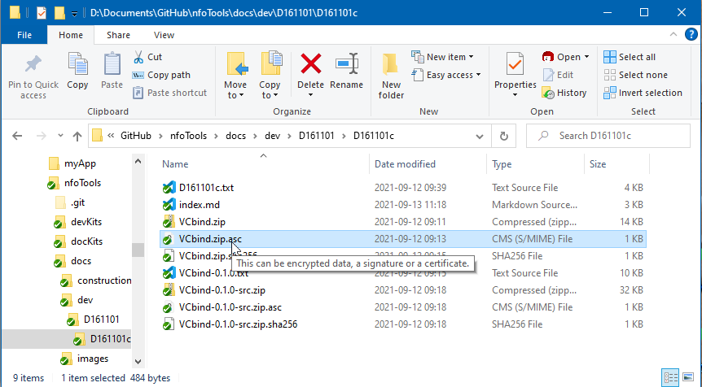
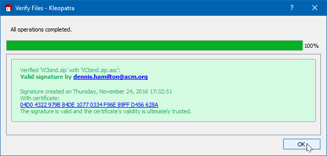
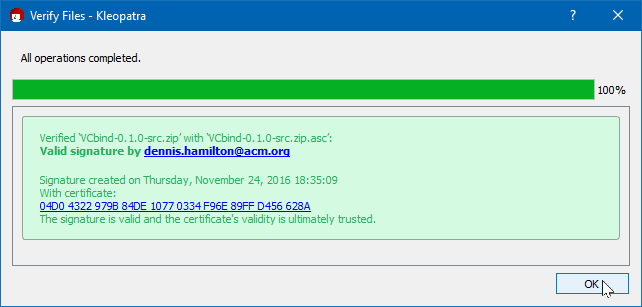
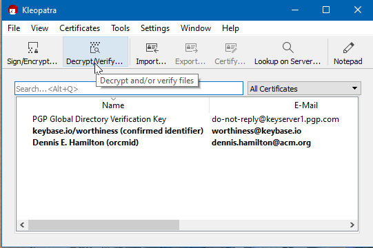
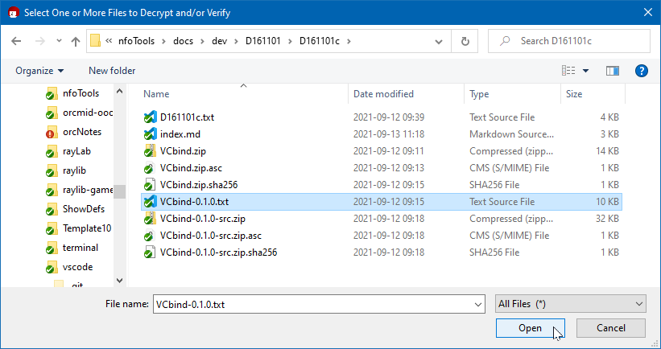
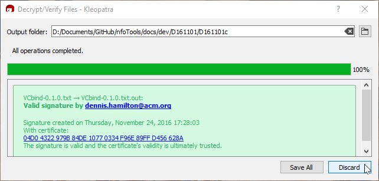
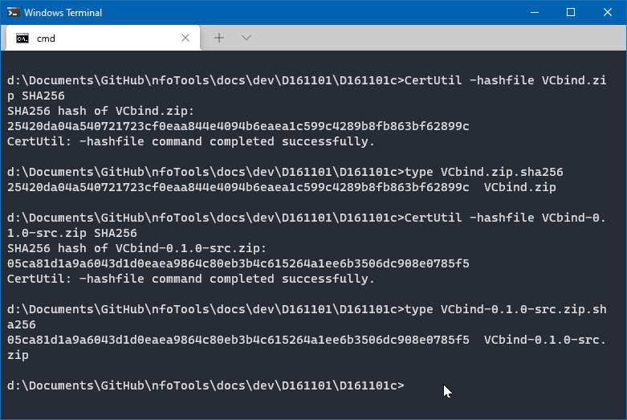

<!-- index.md 0.0.5                 UTF-8                          2021-09-14
     ----1----|----2----|----3----|----4----|----5----|----6----|----7----|--*

                     VCBIND 0.1.0 RELEASE (PRESERVATION)
     -->

# ***VCbind** 0.1.0 Release (Preservation)*

VCbind 0.1.0 was released on 2016-11-25 at
[nfoWare d161101c](https://nfoware.com/dev/2016/11/d161101c.htm).  That
location will be retired.  The release is preserved here.

This release is deprecated. It contains signed materials that refer to
locations at `nfoware.com` instead of here at Github Project
`orcmid/nfoTools`.

Improved documentation will be provided with the superseding VCbind 0.1.1
release.

For more about this material and the [toolcraft](../../../tools/) dependencies
on Zip, PGP, and SHA256, consult the [overview document](../) and descriptions
of later supported releases.  The unpacked release is intended for
[Command Prompt](../../../tools/T060501/) setup of a command-line environment
ready for use of Microsoft Windows native C/C++ development tools.

## VCbind 0.1.0 Release Download Components

| ***Version Filename*** | ***File Content*** |
|         --:            | :--                |
| [`VCbind.zip`](VCbind.zip) | VCbind 0.1.0 Zip Package |
| [`VCbind.zip.asc`](VCbind.zip.asc) | `VCbind.zip` PGP Digital Signature |
| [`VCbind.zip.sha256`](VCbind.zip.sha256) | `VCbind.zip` SHA256 Hash Check Value |
|                                        |                                |
| [`VCbind-0.1.0.txt`](VCbind-0.1.0.txt) | Clear-signed manifest and release not also incorporated in `VCbind.zip` for VCbind 0.1.0 |
|                                        |                                |
| [`VCbind-0.1.0-src.zip`](VCbind-0.1.0-src.zip) | Source code of VCbind 0.1.0 |
| [`VCbind-0.1.0-src.zip.asc`](VCbind-0.1.0-src.zip.asc) | `VCbind-0.1.0-src.zip` PGP Digital Signature |
| [`VCbind-0.1.0-src.zip.sha256`](VCbind-0.1.0-src.zip.sha256) | `VCbind-0.1.0-src.zip` SHA256 Hash Check Value |

## VCbind 0.1.0 Preservation Integrity Confirmation

Confirmation that the files have been preserved intact from their previous
download location is accomplished using already-install gpg4Win software,
including the Kleopatra tool.  Documented toolcraft is employed.

Verification of the `VCbind.zip` digital signature in `VCbind.zip.asc` is
by double-clicking on the `.asc` file.

Kleopatra is launched and the signature is reported as verified.

In the same manner, the VCbind-0.1.0-src.zip signature is verified.

The file `VCbind-0.1.0.txt` is signed with a Cleartext
signature.  That is also verifiable using the Kleopatra tool.

The VCbind-0.1.0.txt selection is made in response to Kleopatra.

Verification is confirmed.  It is unnecessary to save a stripped unsigned
copy.

Although the signatures provide the strongest verification for the integrity
of the downloaded files to their D161101c location, there are also SHA256
hashes that can be confirmed.  These verify that the files have not been
altered since the hashes were derived.  This can be done on Windows using
Command Prompt operations.  The hashes are derived for visual comparison with
the values in the `.sha256` files.

To replicate the signature verifications, obtain the signer's public key with
fingerprint `04D0 4322 979B 84DE 1077  0334 F96E 89FF D456 628A`.  That can
be downloaded at [Apache Key for Orcmid](http://people.apache.org/keys/committer/orcmid.asc).

<!-- ----1----|----2----|----3----|----4----|----5----|----6----|----7----|--*

     0.0.5 2021-09-14T00:16Z Demonstrate verifications
     0.0.4 2021-09-13T11:18Z Touch-ups on intended usage
     0.0.3 2021-09-13T17:37Z Link to release files and account for deprecation
     0.0.2 2021-09-12T16:35Z Create nfoTools placeholder for customization
     0.0.1 2016-11-30T00:07Z Provide Version and Manifest materials
     0.0.0 2016-11-13T02:06Z Create Initial Placeholder (nfoWare.com)

             *** end of docs/dev/D161101/D161101c/index.md ***
     -->
