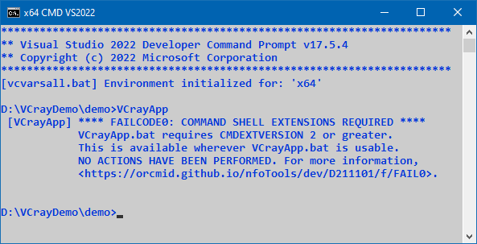

<!-- index.md 0.0.6                 UTF-8                          2023-07-14
     ----1----|----2----|----3----|----4----|----5----|----6----|----7----|--*

                 FAILCODE0: COMMAND SHELL EXTENSIONS REQUIRED
     -->

# ***VCrayApp** [FAILCODE0: COMMAND SHELL EXTENSIONS REQUIRED](.)*

| ***[nfoTools](../../../../)*** | [dev](../../../)[>D211101](../../)[>f](../)[>FAIL0](.) | [index.html](index.html) ***0.0.6 2023-07-14*** |
| :--                |       :-:          | --: |
|  | [Work-in-Progress](FAIL0.txt) |  |
|              |                     |           |
| This Version | since VCrayApp 0.1.0 | [D211101e](../../e) |

This message should never be encountered.  It occurs if the version of
`CMD.exe` being used does not support `CMD EXTENSIONS`.  This should not be
possible with any properly-configured version of Microsoft Windows on an
x64 desktop PC.

One possibility is operation on an inappropriate virtual computer.

Another possibility is damage in installation of VCrayApp or modifications
to the `VCrayApp.bat` file.

Finally, `CMD EXTENSIONS` may have been disabled by some means.  Unless that
can be changed, VCrayApp is not usable.

If a case of this has been encountered "in the wild," please report in an
[nfoTools Discussion](https://github.com/orcmid/nfoTools/discussions)
mentioning VCrayApp FAILCODE0.

----

Discussion about nfoTools is welcome at the
[Discussion section](https://github.com/orcmid/nfoTools/discussions).
Improvements and removal of defects in this particular documentation can be
reported and addressed in the
[Issues section](https://github.com/orcmid/nfoTools/issues).  There are also
relevant [projects](https://github.com/orcmid/nfoTools/projects?type=classic)
from time to time.

<!-- ----1----|----2----|----3----|----4----|----5----|----6----|----7----|--*

     0.0.6 2023-07-14T22:22Z Touch-up
     0.0.5 2023-05-11T18:22Z Update image for VCrayApp-0.1.0 release
     0.0.4 2023-05-07T19:37Z Transpose for new location
     0.0.3 2023-04-21T16:46Z Touch-ups
     0.0.2 2023-04-12T15:58Z Use better image of a FAIL0 failure
     0.0.1 2023-04-10T17:56Z Fixed D211101e link, touch-ups
     0.0.0 2023-04-09T20:19Z Initial account

               *** end D211101/f/FAIL0/index.md ***
     -->
