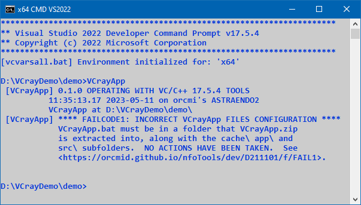

<!-- index.md 0.0.7                 UTF-8                          2023-07-14
     ----1----|----2----|----3----|----4----|----5----|----6----|----7----|--*

            FAILCODE1: INCORRECT VCrayApp FILES CONFIGURATION
     -->

# ***VCrayApp** [FAILCODE1: INCORRECT VCrayApp FILES CONFIGURATION](.)*

| ***[nfoTools](../../../../)*** | [dev](../../../)[>D211101](../../)[>f](../)[>FAIL1](.) | [index.html](index.html) ***0.0.7 2023-07-14*** |
| :--                |       :-:          | --: |
|  | [Work-in-Progress](FAIL1.txt) |  |
|              |                     |           |
| This Version | since VCrayApp 0.1.0 | [D211101e](../../e) |

`VCrayApp.bat` conducts an integrity check on the folders and files that it
is installed with.  If any of the files that are installed directly by
unzipping the VCrayApp-*semver*.zip distribution are missing, this check will
fail, with `FAILCODE1` reported.

The check is for presence of the named files.  Removal or renaming of the
VCrayApp-provided files, and folders, will cause the integrity check to fail.
In-place modification of the files is not detected directly; there may be
other consequences however.

To confirm the expected setup, consult the [D211101](../../)
[VCrayApp Setup](../../a) and details of the specific VCrayApp release
that is installed.  There may be discrepancies in how the setup has been
carried out.

The strict checking is by design.
If confirmation fails in an unmodified VCrayApp setup, please report in
an [nfoTools Discussion](https://github.com/orcmid/nfoTools/discussions)
mentioning VCrayApp FAILCODE1.

For more on the files and their usage, including modifications, see the
[VCrayApp Operation](../../b/) and
[VCrayApp Testing/Lifecycle](../../c/) materials.

----

Discussion about nfoTools is welcome at the
[Discussion section](https://github.com/orcmid/nfoTools/discussions).
Improvements and removal of defects in this particular documentation can be
reported and addressed in the
[Issues section](https://github.com/orcmid/nfoTools/issues).  There are also
relevant [projects](https://github.com/orcmid/nfoTools/projects?type=classic)
from time to time.

<!-- ----1----|----2----|----3----|----4----|----5----|----6----|----7----|--*

     0.0.7 2023-07-14T22:20Z Touch-up
     0.0.6 2023-05-11T20:18Z Fix simple typos
     0.0.5 2023-05-11T18:47Z Update for VCrayApp-0.1.0 release demo
     0.0.4 2023-05-07T19:42Z Reflect transposition to new location
     0.0.3 2023-04-21T17:10Z Touch-ups
     0.0.2 2023-04-14T17:40Z Fix simple typo
     0.0.1 2023-04-11T23:04Z Replace with improved screen capture
     0.0.0 2023-04-10T22:07Z Initial account

               *** end D211101/f/FAIL1/index.md ***
     -->
