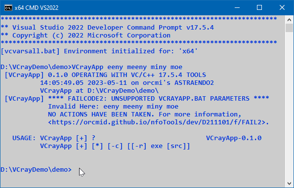

<!-- index.md 0.0.4                 UTF-8                          2023-05-11
     ----1----|----2----|----3----|----4----|----5----|----6----|----7----|--*

              FAILCODE2: UNSUPPORTED VCRAYAPP.BAT PARAMETERS
     -->

# ***VCrayApp** [FAILCODE2: UNSUPPORTED VCRAYAPP.BAT PARAMETERS](.)*

| ***[nfoTools](../../../../)*** | [dev](../../../)[>D211101](../../)[>f](../)[>FAIL2](.) | [index.html](index.html) ***0.0.4 2023-05-11*** |
| :--                |       :-:          | --: |
|  | Work-in-Progress |  |
|              |                     |           |
| This Version | since VCrayApp 0.1.0 | [D211101e](../../e) |

`VCrayApp.bat` verifies the parameter list of the command used to operate it.
As soon as a discrepancy is detected, processing fails.   The failure message
will present information on the parameters containing the failure.

Part of the `USAGE` information is shown as a reminder.

For more on `VCrayApp.bat` operation, see the
[VCrayApp Operation](../../b/) and
[VCrayApp Testing/Lifecycle](../../c/) materials.

----

Discussion about nfoTools is welcome at the
[Discussion section](https://github.com/orcmid/nfoTools/discussions).
Improvements and removal of defects in this particular documentation can be
reported and addressed in the
[Issues section](https://github.com/orcmid/nfoTools/issues).  There are also
relevant [projects](https://github.com/orcmid/nfoTools/projects?type=classic)
from time to time.

<!-- ----1----|----2----|----3----|----4----|----5----|----6----|----7----|--*

     0.0.4 2023-05-11T21:17Z Redo the demo screen capture
     0.0.3 2023-05-07T19:47Z Reflect transposition to new location
     0.0.2 2023-04-21T18:45Z Touch-up
     0.0.1 2023-04-14T17:42Z Fix simple typo
     0.0.0 2023-04-12T18:55Z Initial page from 0.0.1 FAIL1 boilerplate.

               *** end D211101/f/FAIL2/index.md ***
     -->
