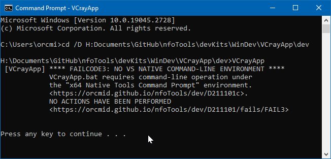
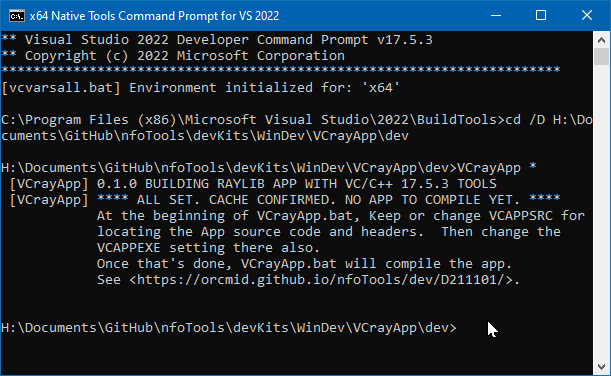

<!-- index.md 0.0.4                 UTF-8                          2023-05-07
     ----1----|----2----|----3----|----4----|----5----|----6----|----7----|--*

              FAILCODE3: NO VS NATIVE COMMAND-LINE ENVIRONMENT
     -->

# ***VCrayApp** [FAILCODE3: NO VS NATIVE COMMAND-LINE ENVIRONMENT](.)*

| ***[nfoTools](../../../../)*** | [dev](../../../)[>D211101](../../)[>f](../)[>FAIL3](.) | [index.html](index.html) ***0.0.4 2023-05-07*** |
| :--                |       :-:          | --: |
|  | Work-in-Progress |  |
|              |                     |           |
| This Version | since VCrayApp 0.1.0 | [D211101e](../../e) |

VCrayApp operation depends on the VS "x64 Developer Command Prompt" being
set up as part of initiating command-line interaction.  This establishes an
environment in which all of the VS Build Tools and all of the Windows C/C++
libraries are ready for use.  It also allows Visual Studio Code to detect and
check for named include libraries, with Microsoft Intellisense assistance.
There is also improved interaction with the Github Copilot AI under those
conditions.  See [VCrayApp Setup](../../D211101a) for how to find and use
the "x64 Developer Command Prompt."

Initiation of a command-line session with the x64 Nstive Tools Command Prompt
is revealed in several ways.

* The title bar of the command-line window reflects the initiation.
* The first 3 lines displayed in the window identify the usage and the
version of Visual Studio involved.
* The 4th line confirms that an x64 compiling environment is intialized.

The current directory is made the location of the installed Tools, shown
in the prompt portion of the 5th line.  That is not useful as a place for
creating a project.  It is necessary to change directory to the location
of the VCrayApp project to be worked on.

The current directory can be made a better location of your choosing by
creation of shortcuts for the "x64 Developer Command Prompt."  See
[VCrayApp Setup](../../a) and [VCrayApp Operation](../../b/).

----

Discussion about nfoTools is welcome at the
[Discussion section](https://github.com/orcmid/nfoTools/discussions).
Improvements and removal of defects in this particular documentation can be
reported and addressed in the
[Issues section](https://github.com/orcmid/nfoTools/issues).  There are also
relevant [projects](https://github.com/orcmid/nfoTools/projects?type=classic)
from time to time.

<!-- ----1----|----2----|----3----|----4----|----5----|----6----|----7----|--*

     0.0.4 2023-05-07T19:52Z Reflect transposition to new location
     0.0.3 2023-04-21T19:04Z Touch-ups
     0.0.2 2023-04-14T17:44Z Fix simple typo
     0.0.0 2023-04-12T20:46Z Initial page from 0.0.0 FAIL2 boilerplate.

               *** end D211101/f/FAIL3/index.md ***
     -->
