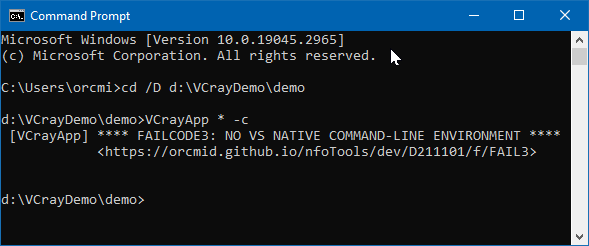
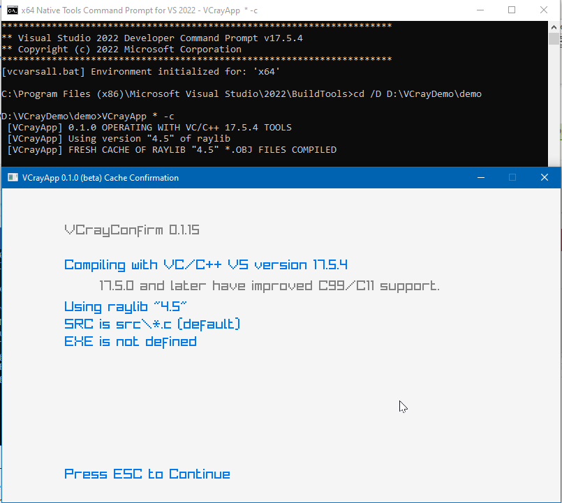

<!-- index.md 0.0.6                 UTF-8                          2023-05-12
     ----1----|----2----|----3----|----4----|----5----|----6----|----7----|--*

              FAILCODE3: NO VS NATIVE COMMAND-LINE ENVIRONMENT
     -->

# ***VCrayApp** [FAILCODE3: NO VS NATIVE COMMAND-LINE ENVIRONMENT](.)*

| ***[nfoTools](../../../../)*** | [dev](../../../)[>D211101](../../)[>f](../)[>FAIL3](.) | [index.html](index.html) ***0.0.6 2023-05-12*** |
| :--                |       :-:          | --: |
|  | Work-in-Progress |  |
|              |                     |           |
| This Version | since VCrayApp 0.1.0 | [D211101e](../../e) |

This failure occurs if, for any reason, VCrayApp.bat is operated from other
than a Visual Studio Developer Command Prompt.  In the illustrative case, a
direct use of CMD has been made.

VCrayApp operation depends on a command prompt that initializes for use of
Visual Studio build tools.  See [VCrayApp Setup](../../a) for how to find and
use "x64 Developer Command Prompt."

Initiation of a command-line session with the x64 Native Tools Command Prompt
is revealed in several ways.

* The title bar of the command-line window reflects the initiation.
* The first 4 lines displayed in the window identify the usage and the
version of Visual Studio involved.
* The 5th line confirms that the preferred x64 compiling environment is
intialized.

The current directory is made the location of the installed Tools, shown
in the prompt portion of the 7th line.  That is not useful as a place for
creating a project.  It is necessary to change directory to the location
of the VCrayApp project to be worked on (D:\VCrayDemo\demo in this case).

The current directory can be made a better location of your choosing by
creation of shortcuts for the "x64 Developer Command Prompt."  See
[VCrayApp Setup](../../a) and [VCrayApp Operation](../../b/).

----

Discussion about nfoTools is welcome at the
[Discussion section](https://github.com/orcmid/nfoTools/discussions).
Improvements and removal of defects in this particular documentation can be
reported and addressed in the
[Issues section](https://github.com/orcmid/nfoTools/issues).  There are also
relevant [projects](https://github.com/orcmid/nfoTools/projects?type=classic)
from time to time.

<!-- ----1----|----2----|----3----|----4----|----5----|----6----|----7----|--*

     0.0.6 2023-05-12T20:32Z Fix typo
     0.0.5 2023-05-12T19:54Z Update to VCrayApp=0.1.0 release candidate
     0.0.4 2023-05-07T19:52Z Reflect transposition to new location
     0.0.3 2023-04-21T19:04Z Touch-ups
     0.0.2 2023-04-14T17:44Z Fix simple typo
     0.0.0 2023-04-12T20:46Z Initial page from 0.0.0 FAIL2 boilerplate.

               *** end D211101/f/FAIL3/index.md ***
     -->
