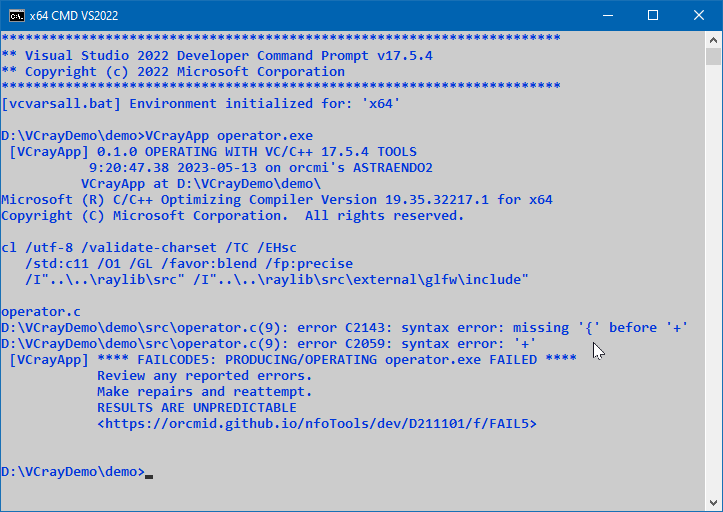
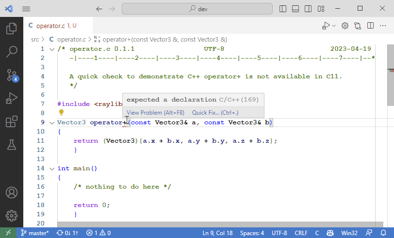

<!-- index.md 0.0.9                 UTF-8                          2023-05-14
     ----1----|----2----|----3----|----4----|----5----|----6----|----7----|--*

              FAILCODE5: PRODUCING/OPERATING %VCEXE% FAILED
     -->

# ***VCrayApp** [FAILCODE5: PRODUCING/OPERATING %VCEXE% FAILED](.)*

| ***[nfoTools](../../../../)*** | [dev](../../../)[>D211101](../../)[>](../)[>FAIL5](.) | [index.html](index.html) ***0.0.9 2023-05-14*** |
| :--                |       :-:          | --: |
|  | Work-in-Progress |  |
|              |                     |           |
| This Version | since VCrayApp 0.1.0 | [D211101e](../../e) |

`FAILCODE5`, and the companion [`FAILCODE4`](..\FAIL4), arise from a variety
of build and operation failures in operation of `VCrayApp.bat`.  If operation
is in terse (option `*`) mode, there is no helpful information about
the failure.  In that case, rerun `VCrayApp.bat` directly in verbose mode,
using the same parameters without the initial `*`.

NOTE: If VCrayApp is embedded and operated under another script, VCrayApp
should be rerun directly for trouble-shooting.  Follow the instructions
provided with the containing software (e.g., with
[VCrayVerify](https://orcmid.github.io/nfoTools/dev/D230202/)).

The `%VCEXE%` value shown in an actual `FAILCODE5` report will be one of

* The executable (`exe` parameter) specified for the project -- the most
likely case
* Different stages in building/refreshing the cache of raylib components
  * `VCrayVerCheck.exe`
  * `VCrayVer.bat`
  * `VCrayConfirm.exe`

## %VCEXE% IS THE PROJECT EXECUTABLE (%VCAPPEXE% VALUE)

If [initial setup of VCrayApp](../../a) has been successful, with
successful initialization/update of the VCrayApp cache,  error cases are
typically when compiling the project source code (`src` parameter or the
`src\*.c` default location).

That's the case for the demonstration project with `%VCEXE%` of
`operator.exe`.

### Source-Code Compilation Diagnostics

The following `FAILCODE5` incident provides simple-to-research diagnostics.

Typically, the name of the file being compiled (here, `operator.c`) is named
by VC/C++ and any diagnostic messages will follow that name, as shown above.

Diagnostic messages can be cryptic.  However, there is key information.  Each
message indicates the file being processed (`operator.c`) and the number of
the line in that file (`(9)`) along with an error code and some explanatory
text.  These might not be particularly informative.  The diagnostics do
identify places to look in the code for which compilation is attempted.

Although this is a contrived example, similar considerations will apply in other projects along with a great variety of diagnostic messages.

In line 9 of example `operator.c` viewed in Visual Studio Code, the difficulty
is with the "+" there.  This is signified by the squiggly underlining beneath
the "+" and the pop-up explanation when placing the cursor there.

The problem is that `operator` is not a keyword of C Language.  It is a C++
feature not supported in C.  This small program was written to confirm that.
It is unsurprising that the diagnostics do not recognize the actual fault,
reporting simply on the difficulty in terms of C Language syntax.

TIP.  Beside the (expected) diagnostics, the VS Code view of `operator.c` also
provides some affirmative detail.  VS Code is able to access `raylib.h` and
rely on its definitions.  The definition of `Vector3` is recognized and the
C/C++ Intellisense feature finds nothing objectionable except the suspicious
"+" on line 9.  It is valuable to notice that VS Code does not identify any
other concern.  (Without that "+" the code appears to be a legitimate
definition of a function named `operator`.  That usage is discouraged,
but not forbidden, in C Language because of its significance as a keyword in
C++.)

### Project Link Errors

Link errors in the project technically arise from conflicts/errors in the
names of external functions, the absence (or too many) of `main`, or even
incompatible components among those being linked.

In the case of module conflicts, it is important that the same "x64 Developer
Command Prompt" be used every time VCrayApp is used.  Any time a new release
(or `-dev` update) is installed, it is important to rebuild the VCrayApp
project's `cache\` so the raylib header files and the compiled raylib
components are compatible.

For a simple standalone project, there should be no modifications of the
VCrayApp project cache\ folder *.opt files.  If they have been altered,
restore them to original form and determine if the problem remains.

For better understanding of the link process, review
[VCrayApp Operation](../../b) as well as information on the
[VS Build Tools](https://orcmid.github.io/nfoTools/tools/T211002/).

If the linking problem remains, consult the
[nfoTools issues](https://github.com/orcmid/nfoTools/issues) on GitHub to see
if there is a known problem. Add an issue for your case if you are unable to
resolve it first.   There may be relevant
[raylib issues](https://github.com/raysan5/raylib/issues).

----

Discussion about nfoTools is welcome at the
[Discussion section](https://github.com/orcmid/nfoTools/discussions).
Improvements and removal of defects in this particular documentation can be
reported and addressed in the
[Issues section](https://github.com/orcmid/nfoTools/issues).  There are also
relevant [projects](https://github.com/orcmid/nfoTools/projects?type=classic)
from time to time.

<!-- ----1----|----2----|----3----|----4----|----5----|----6----|----7----|--*

     0.0.9 2023-05-13T16:41Z Update with VCrayApp-0.1.0 demo example
     0.0.8 2023-05-07T20:05Z Reflect transposition to new location
     0.0.7 2023-04-23T19:49Z Small touch-ups of current draft
     0.0.6 2023-04-21T20:07Z Touch-ups of this draft portion
     0.0.5 2023-04-19T16:58Z Cleaning up the likely cases
     0.0.4 2023-04-16T01:34Z Still working around the display problem
     0.0.3 2023-04-15T22:59Z Attempt to get FAIL5-verbose displayed
     0.0.2 2023-04-15T20:16Z Tidied Intermediate Draft
     0.0.1 2023-04-15T19:29Z Intermediate Review Draft
     0.0.0 2023-04-13T21:42Z Initial page from 0.0.0 FAIL3 boilerplate.

               *** end D211101/f/FAIL5/index.md ***
     -->
