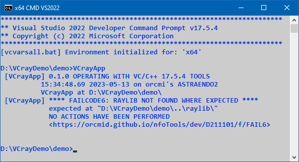
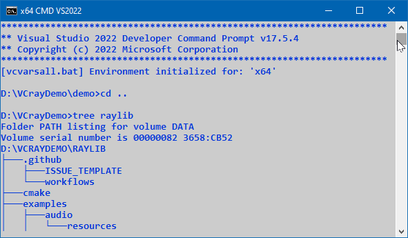
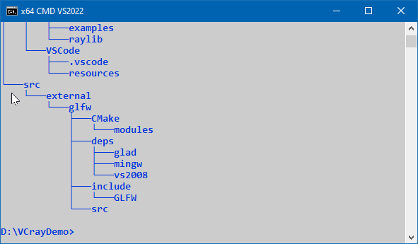

<!-- index.md 0.0.5                 UTF-8                          2023-07-14
     ----1----|----2----|----3----|----4----|----5----|----6----|----7----|--*

              FAILCODE6: RAYLIB NOT FOUND WHERE EXPECTED
     -->

# ***VCrayApp** [FAILCODE6: RAYLIB NOT FOUND WHERE EXPECTED](.)*

| ***[nfoTools](../../../../)*** | [dev](../../../)[>D211101](../../)[>f](../)[>FAIL6](.) | [index.html](index.html) ***0.0.5 2023-07-14*** |
| :--                |       :-:          | --: |
|  | [Work-in-Progress](FAIL6.txt) |  |
|              |                     |           |
| This Version | since VCrayApp 0.1.0 | [D211101e](../../e) |



## Typical Causes

* The initial attempt to populate the VCrayApp `cache\` with raylib components
fails because a nearby `raylib\` directory is set up incorrectly or not at
all.
* When there have previously been successful `cache` creations, subsequent
updates or modifications to `raylib` or `VCrayApp.bat` are defective.
* When there has not been a successful first run yet, there are some likely
suspects.
  * `raylib` has not been setup at the same level as the project folder (e.g.,
at `VCrayDemo\raylib\` and reachable from `VCrayDemo\demo\`).
  * extraction of a raylib source release such as `raylib-4.5.0.zip` into`raylib\` is incorrect.

## Confirmation of raylib\ Setup

In a command prompt, navigate to the project folder, the one that is the
extracted and renamed `VCrayApp-*semver*.zip`.  From that location, perform

```bat
cd ..
tree raylib
```

The beginning of the `tree`-command output should be similar to this.



At the end of the command output, the `raylib\src` folder structure should
appear.



If this is unsuccessful, please review [VCrayApp Setup](../../a/) and redo
the setup carefully.

## Background

FAILCODE6 signifies that a released **source-code** version of raylib, in a
folder named `raylib\` is not positioned properly on the same drive and level
as the unzipped VCrayApp project.

The determination is that `raylib\src\raylib.h` does not exist using the
location described in the diagnostic message.

NOTE: If a clone of the raylib Github repository is used, the folder holding
the clone must be named `raylib` no matter what the clone is named.

----

Discussion about nfoTools is welcome at the
[Discussion section](https://github.com/orcmid/nfoTools/discussions).
Improvements and removal of defects in this particular documentation can be
reported and addressed in the
[Issues section](https://github.com/orcmid/nfoTools/issues).  There are also
relevant [projects](https://github.com/orcmid/nfoTools/projects?type=classic)
from time to time.

<!-- ----1----|----2----|----3----|----4----|----5----|----6----|----7----|--*

     0.0.5 2023-07-14T22:12Z Touch-up
     0.0.4 2023-05-13T23:10Z Expand in support of VCrayApp-0.1.0
     0.0.3 2023-05-07T20:09Z Reflect transposition to new location
     0.0.2 2023-04-24T22:37Z Improved draft explanation
     0.0.1 2023-04-23T20:16Z Completed draft
     0.0.0 2023-04-22T02:45Z Boilerplate from 0.0.6 FAIL5.

                 *** end D211101/f/FAIL6/index.md ***
     -->
