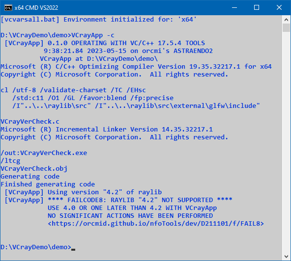

<!-- index.md 0.0.5                 UTF-8                          2023-07-14
     ----1----|----2----|----3----|----4----|----5----|----6----|----7----|--*

                    FAILCODE8: RAYLIB %VCRAYVER% NOT SUPPORTED
     -->

# ***VCrayApp** [FAILCODE8: RAYLIB %VCRAYVER% NOT SUPPORTED](.)*

| ***[nfoTools](../../../../)*** | [dev](../../../)[>D211101](../../)[>f](../)[>FAIL8](.) | [index.html](index.html) ***0.0.5 2023-07-14*** |
| :--                |       :-:          | --: |
|  | [Work-in-Progress](FAIL8.txt) |  |
|              |                     |           |
| This Version | since VCrayApp 0.1.0 | [D211101e](../../e) |

The first use of FAILCODE8 is for raylib-4.2.0.  There is a defect in an
external dependency that prevents compilation of the complete cache. There
will be no correction. The corrected external dependency is incorporated in
raylib-4.5.0.

The installed `raylib\` should be replaced with either 4.0.0 or 4.5.0,
neither of which presents a problem for Visual Studio Build Tools.

This message will also arise if there are releases beyond 4.5.0 that cannot
be cached using the Visual Studio Build Tools.

NOTE: VCrayApp will not reject `-dev` versions beyond 4.0.  The prospects of
failures are not protected against in such cases, which should always be
regarded as experimental.

The detection process employed here, and shown in the verbose demonstration,
is the same as for [FAIL7](..\FAIL7), except an identified raylib version is
involved.

For current information on acceptable raylib versions, see
[VCrayApp Setup](../../a).

----

Discussion about nfoTools is welcome at the
[Discussion section](https://github.com/orcmid/nfoTools/discussions).
Improvements and removal of defects in this particular documentation can be
reported and addressed in the
[Issues section](https://github.com/orcmid/nfoTools/issues).  There are also
relevant [projects](https://github.com/orcmid/nfoTools/projects?type=classic)
from time to time.

<!-- ----1----|----2----|----3----|----4----|----5----|----6----|----7----|--*

     0.0.5 2023-07-14T22:10Z Touch-up
     0.0.4 2023-05-15T16:51Z Update with improved VCrayApp-0.1.0 demo
     0.0.3 2023-05-07T20:20Z Reflect transposition to new location
     0.0.2 2023-04-24T22:55Z Touch-ups
     0.0.1 2023-04-24T02:10Z Complete draft
     0.0.0 2023-04-23T20:01Z Boilerplate from 0.0.0 FAIL7.

               *** end D211101/f/FAIL8/index.md ***
     -->
