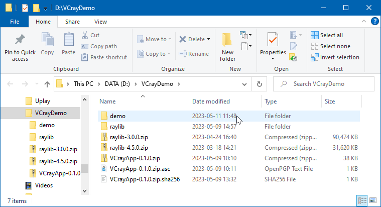
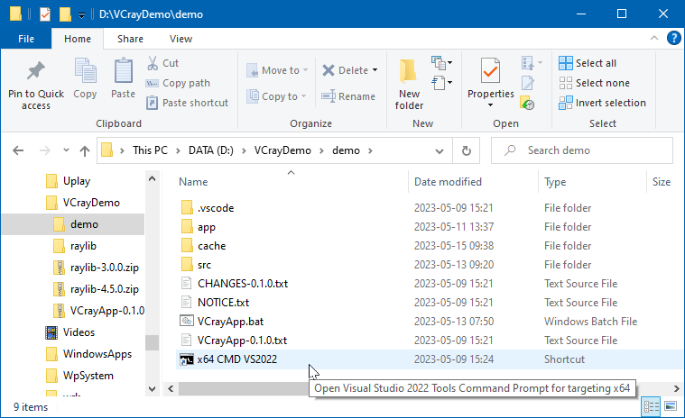
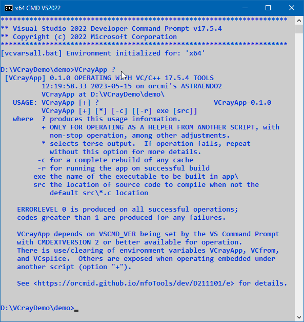

<!-- index.md 0.0.8                 UTF-8                          2023-05-15
     ----1----|----2----|----3----|----4----|----5----|----6----|----7----|--*

                         VCRAYAPP FAILCODE MESSAGES
     -->

# ***D211101f** [VCrayApp FAILCODE MESSAGES](.)*

| ***[nfoTools](../../../)*** | [dev](../../)[>D211101](../)[>f](.) | [index.html](index.html) ***0.0.8 2023-05-15*** |
| :--                |       :-:          | --: |
|  | Work-in-Progress |  |
|              |                     |           |
| This Version | as of VCrayApp 0.1.0 beta release | [D211101e](../e) |

This material is provided to supplement VCrayApp **FAILCODE***n* messages from
`VCrayApp.bat` starting with VCrayApp-0.1.0. When a subsequent version of
VCrayApp has significant changes for one of these, a new FAILCODE will be
introduced.

These explanations are intended to support trouble-shooting and failures in
performance of `VCrayApp.bat` in a VCrayApp-based project.

Feedback and requests concerning this material should be addressed to
the [nfoTools GitHub Project](https://github.com/orcmid/nfoTools) with mention
of D211101 and the particular `FAILCODE`.  Feedback on actual
experience and the utility of these explanations is valued.

Review [discussions](https://github.com/orcmid/nfoTools/discussions),
[issues](https://github.com/orcmid/nfoTools/issues), and
[projects](https://github.com/orcmid/nfoTools/projects?type=classic) for
discussions and comments related to specific VCrayApp releases and their
application.

## FAILCODE CATALOG

| LABEL | FAILCODE |
| :-: | :- |
| [:FAIL0](FAIL0) | FAILCODE0: COMMAND SHELL EXTENSIONS REQUIRED |
| [:FAIL1](FAIL1) | FAILCODE1: INCORRECT VCrayApp FILES CONFIGURATION |
| [:FAIL2](FAIL2) | FAILCODE2: UNSUPPORTED VCRAYAPP.BAT PARAMETERS |
| [:FAIL3](FAIL3) | FAILCODE3: NO VS NATIVE COMMAND-LINE ENVIRONMENT |
| [:FAIL4](FAIL4) | FAILCODE4: COMPILING CACHE OF RAYLIB FILES FAILED |
| [:FAIL5](FAIL5) | FAILCODE5: PRODUCING/OPERATING %VCEXE% FAILED |
| [:FAIL6](FAIL6) | FAILCODE6: RAYLIB NOT FOUND WHERE EXPECTED |
| [:FAIL7](FAIL7) | FAILCODE7: RAYLIB VERSION NOT > 3.0.0 |
| [:FAIL8](FAIL8) | FAILCODE8: RAYLIB %VCRAYVER% NOT SUPPORTED |

The labels are where the message is produced in `VCrayApp.bat` code.  All
the references to them can be found by searching the `VCrayApp.bat` file.

## THE DEMONSTRATION SETUP

For demonstration purposes, the folder `VCrayDemo` is setup with two
subfolders, `VCrayDemo\raylib\`, the installed raylib source-code release, and
`VCrayDemo\demo\`, the VCrayApp setup for the project.  The additional files
are downloaded zip packages for handy reuse.  The two files for checking the
integrity of the VCrayApp-*semver*.zip are also kept handy.

Folder `VCrayDemo\demo\` is simply the standard VCrayApp structure with one
addition.  A [[custom shortcut](../a/) is created for initiating a VS
Developer Command Prompt directly at `VCrayDemo\demo`.  The demonstrations
are initiated by double-clicking directly on that shortcut in the Windows File
Explorer.  For example, it simplifies checking VCrayApp usage.

For comparison with usage of the Command Prompt directly, see the examples for
[FAILCODE3](FAIL3).

----

Discussion about nfoTools is welcome at the
[Discussion section](https://github.com/orcmid/nfoTools/discussions).
Improvements and removal of defects in this particular documentation can be
reported and addressed in the
[Issues section](https://github.com/orcmid/nfoTools/issues).  There are also
relevant [projects](https://github.com/orcmid/nfoTools/projects?type=classic)
from time to time.

<!-- ----1----|----2----|----3----|----4----|----5----|----6----|----7----|--*

     0.0.8 2023-05-15T20:41Z Expand for VCrayApp-0.1.0 Release Candidate
     0.0.7 2023-05-06T22:47Z Transpose from D211101/fails 0.0.6
     0.0.6 2023-04-21T16:38Z Touch-ups and connection of FAIL6-FAIL8
     0.0.5 2023-04-17T16:15Z Connect FAIL4-FAIL5
     0.0.4 2023-04-12T20:54Z Connect FAIL3
     0.0.3 2023-04-12T19:02Z Touch-up, connecting FAIL2
     0.0.2 2023-04-10T22:26Z Provide touch-ups and connect FAIL1
     0.0.1 2023-04-09T20:00Z Connect FAIL0
     0.0.0 2023-04-09T17:41Z Create Initial Placeholder from D211101d 0.0.8

                     *** end D211101/f/index.md ***
     -->
