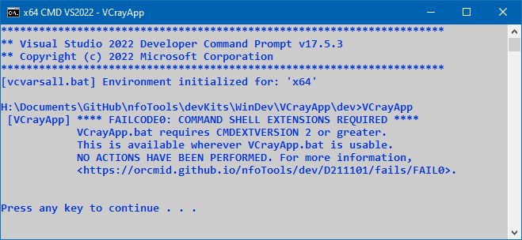

<!-- index.md 0.0.0                 UTF-8                          2023-04-09
     ----1----|----2----|----3----|----4----|----5----|----6----|----7----|--*

                 FAILCODE0: COMMAND SHELL EXTENSIONS REQUIRED
     -->

# ***VCrayApp** [FAILCODE0: COMMAND SHELL EXTENSIONS REQUIRED](.)*

| ***[nfoTools](../../../../)*** | [dev](../../../)[>D211101](../../)[>fails](../)[>FAIL0](.) | [index.html](index.html) ***0.0.0 2023-04-09*** |
| :--                |       :-:          | --: |
|  | Work-in-Progress |  |
|              |                     |           |
| This Version | as of VCrayApp 0.1.0 beta release | [D211101e](../D211101e) |

This message should never be encountered.  It occurs if the version of CMD.exe
being used does not support CMD EXTENSIONS.  This should not be possible with
any properly-configured version of Microsoft Windows on an x64 desktop PC.

One possibility is operation on an inappropriate virtual computer.

Another possibility is damage in installation of VCrayApp or modifications
to the VCrayApp.bat file.  (That was necessary to trigger the failure for the
image on this page.)

If a case of this has been encountered "in the wild," please report in an
[nfoTools Discussion](https://github.com/orcmid/nfoTools/discussions)
mentioning VCrayApp FAIL0.

----

Discussion about nfoTools is welcome at the
[Discussion section](https://github.com/orcmid/nfoTools/discussions).
Improvements and removal of defects in this particular documentation can be
reported and addressed in the
[Issues section](https://github.com/orcmid/nfoTools/issues).  There are also
relevant [projects](https://github.com/orcmid/nfoTools/projects) from time to
time.

<!-- ----1----|----2----|----3----|----4----|----5----|----6----|----7----|--*

     0.0.0 2023-04-09T20:19Z Initial account

               *** end D211101/fails/FAIL0/index.md ***
     -->
