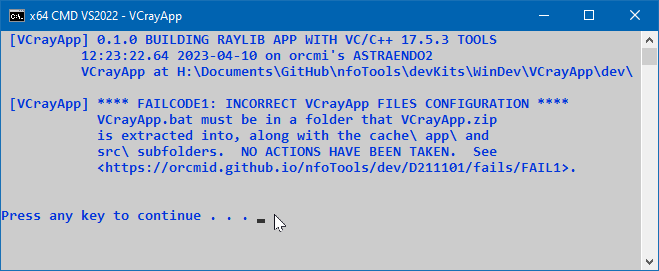

<!-- index.md 0.0.0                 UTF-8                          2023-04-10
     ----1----|----2----|----3----|----4----|----5----|----6----|----7----|--*

            FAILCODE1: INCORRECT VCrayApp FILES CONFIGURATION
     -->

# ***VCrayApp** [FAILCODE1: INCORRECT VCrayApp FILES CONFIGURATION](.)*

| ***[nfoTools](../../../../)*** | [dev](../../../)[>D211101](../../)[>fails](../)[>FAIL1](.) | [index.html](index.html) ***0.0.0 2023-04-10*** |
| :--                |       :-:          | --: |
|  | Work-in-Progress |  |
|              |                     |           |
| This Version | since VCrayApp 0.1.0 beta release | [D211101e](../../D211101e) |

`VCrayApp.bat` conducts an integrity check on the folders and files that it
is installed with.  If any of the files that are installed directly by
unzipping the VCrayApp-*semver*.zip distribution are missing, this check will
fail, with `FAILCODE1` reported.

The check is for presence of the named files.  Removal or renaming of the
VCrayApp-provided files, and folders, will cause the integrity check to fail.
Modifications are not detected directly; there may be other consequences
however.

For more on the files and their usage, including modifications, see the
[VCrayApp Operation](../../D211101b/) and
[VCrayApp Testing/Lifecycle](../../D211101c/) materials.

The strict checking is by design; it being undesirable is not a defect.
If confirmation fails in an unmodified VCrayApp setup, please report in
an [nfoTools Discussion](https://github.com/orcmid/nfoTools/discussions)
mentioning VCrayApp FAIL1.

----

Discussion about nfoTools is welcome at the
[Discussion section](https://github.com/orcmid/nfoTools/discussions).
Improvements and removal of defects in this particular documentation can be
reported and addressed in the
[Issues section](https://github.com/orcmid/nfoTools/issues).  There are also
relevant [projects](https://github.com/orcmid/nfoTools/projects) from time to
time.

<!-- ----1----|----2----|----3----|----4----|----5----|----6----|----7----|--*

     0.0.0 2023-04-10T22:07Z Initial account

               *** end D211101/fails/FAIL1/index.md ***
     -->
