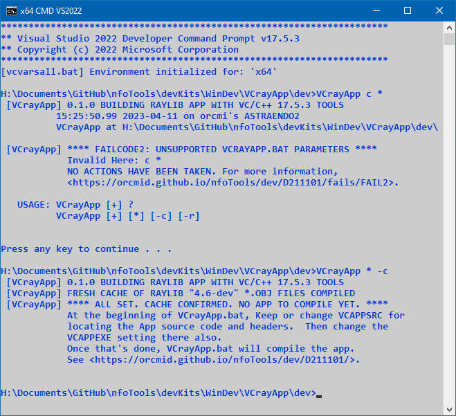

<!-- index.md 0.0.0                 UTF-8                          2023-04-12
     ----1----|----2----|----3----|----4----|----5----|----6----|----7----|--*

              FAILCODE2: UNSUPPORTED VCRAYAPP.BAT PARAMETERS
     -->

# ***VCrayApp** [FAILCODE2: UNSUPPORTED VCRAYAPP.BAT PARAMETERS](.)*

| ***[nfoTools](../../../../)*** | [dev](../../../)[>D211101](../../)[>fails](../)[>FAIL2](.) | [index.html](index.html) ***0.0.0 2023-04-12*** |
| :--                |       :-:          | --: |
|  | Work-in-Progress |  |
|              |                     |           |
| This Version | since VCrayApp 0.1.0 beta release | [D211101e](../../D211101e) |

`VCrayApp.bat` verifies the parameter list of the command used to operate it.
As soon as a discrepancy is detected, processing fails.   The failure message
will present the sequence of options starting with the unsupported one.

In the example, the command `VCrayApp c *` fails with `FAILCODE2`.  Part of
the `USAGE` information is shown as a reminder.

In the continuation, command `VCrayApp * -c` is used and a non-verbose message
sequence is presented.  In this particular case, the VCrayApp cache was filled
and a confirmation program was demonstrated (not shown).  The final message
of that use provides a summary.  In this case, customization of `VCrayApp.bat`
has not yet been done for programming a standalone raylib-using project.

For more on `VCrayApp.bat` operation, including modifications, see the
[VCrayApp Operation](../../D211101b/) and
[VCrayApp Testing/Lifecycle](../../D211101c/) materials.

----

Discussion about nfoTools is welcome at the
[Discussion section](https://github.com/orcmid/nfoTools/discussions).
Improvements and removal of defects in this particular documentation can be
reported and addressed in the
[Issues section](https://github.com/orcmid/nfoTools/issues).  There are also
relevant [projects](https://github.com/orcmid/nfoTools/projects?type=classic)
from time to time.

<!-- ----1----|----2----|----3----|----4----|----5----|----6----|----7----|--*

     0.0.0 2023-04-12T18:55Z Initial page from 0.0.1 FAIL1 boilerplate.

               *** end D211101/fails/FAIL2/index.md ***
     -->
