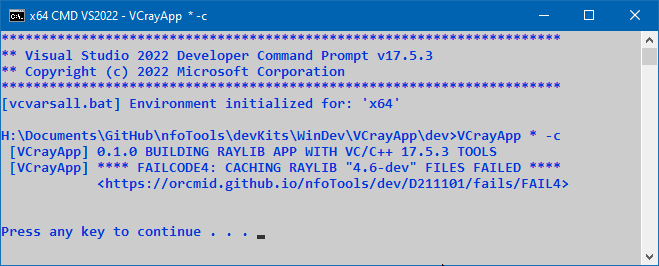
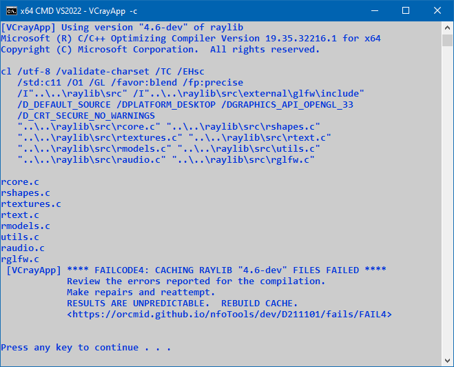

<!-- index.md 0.0.1                 UTF-8                          2023-04-20
     ----1----|----2----|----3----|----4----|----5----|----6----|----7----|--*

              FAILCODE4: COMPILING CACHE OF RAYLIB FILES FAILED
     -->

# ***VCrayApp** [FAILCODE4: COMPILING CACHE OF RAYLIB FILES FAILED](.)*

| ***[nfoTools](../../../../)*** | [dev](../../../)[>D211101](../../)[>fails](../)[>FAIL4](.) | [index.html](index.html) ***0.0.1 2023-04-20*** |
| :--                |       :-:          | --: |
|  | Work-in-Progress |  |
|              |                     |           |
| This Version | since VCrayApp 0.1.0 beta release | [D211101e](../../D211101e) |

## PROBABLE DIAGNOSIS

With all of the checks that have succeeded before this point, it is likely
that the failure is from a small number of causes.

* The installed raylib source code is from a release later than 4.5 having
breaking changes that impact use of the VC/C++ compiler or VCrayApp itself.
  * Revert to raylib 4.5.0 or the latest stable release known not to be
problematic.
  * Check [D211101](../..) for any helpful notices.
* The installed raylib source code is from an under-development release in
which a defect or breaking changes impacts VS Build Tools operation.
  * If working on a raylib `-dev` release is important, check with the
[raylib project](https://github.com/raysan5/raylib/) and also ensure the
latest stable release of VS Build Tools is being used.
  * Otherwise, revert to use of a stable
 [raylib source-code release](https://github.com/raysan5/raylib/releases)
 known to be usable with VCrayApp.  Ensure the latest stable release of
 VCrayApp is also being used.
* There have been modifications made to VCrayApp cache\*.opt files that
prevent successful compilation of raylib components into the cache.
  * Restore the cache\*.opt files that are supplied with the version of
VCrayApp being used.
  * Ensure that the latest stable version of VCrayApp is being used.
* Modifications to VCrayApp.bat have corrupted cache-creation/-update
operation.  (That's how these messages have been forced for documentation,)
  * Reinstallation of VCrayApp is advisable.

## TROUBLE-SHOOTING

When VCrayApp is operate in terse (option "*") mode, there are no details
supporting determination of the failure.  Unless something obvious explains
this failure, it is important to repeat the operation using VCrayApp without any parameters. A cache rebuild will be attempted automatically.

IMPORTANT: If VCrayApp is being operated embedded in a larger procedure, it
is necessary to troubleshoot by operating VCrayApp.bat directly.  Building
of the cache depends on VCrayApp alone.  A standalone use of VCrayApp.bat
is necessary to obtain details behind the FAILCODE4.  No modifications of
VCrayApp.bat are required to accomplish this.  There will be no impact on
returning to embedded use once the problem is resolved.

On a verbose running of VCrayApp.bat, Any compiler messages that lead to
`FAILCODE4` should be seen between the `[VCrayApp] Using version ...` message
shown at the top of the screen capture above and the
`[VCrayApp] **** FAILCODE4 ...` message line.  The lines before the first
diagnostice message should be identical to the lines shown above, starting
with the `cl /utf8 ...` line.  If there are differences, the differences may
be a factor in the failure.

There are two factors in understanding what the problem is, assuming it is not
yet obvious: (1) what has succeeded so far, and (2) what are possible factors
now.

----

Discussion about nfoTools is welcome at the
[Discussion section](https://github.com/orcmid/nfoTools/discussions).
Improvements and removal of defects in this particular documentation can be
reported and addressed in the
[Issues section](https://github.com/orcmid/nfoTools/issues).  There are also
relevant [projects](https://github.com/orcmid/nfoTools/projects?type=classic)
from time to time.

<!-- ----1----|----2----|----3----|----4----|----5----|----6----|----7----|--*

     0.0.1 2023-04-20T20:12Z Intermediate draft
     0.0.0 2023-04-13T21:42Z Initial page from 0.0.0 FAIL3 boilerplate.

               *** end D211101/fails/FAIL4/index.md ***
     -->
