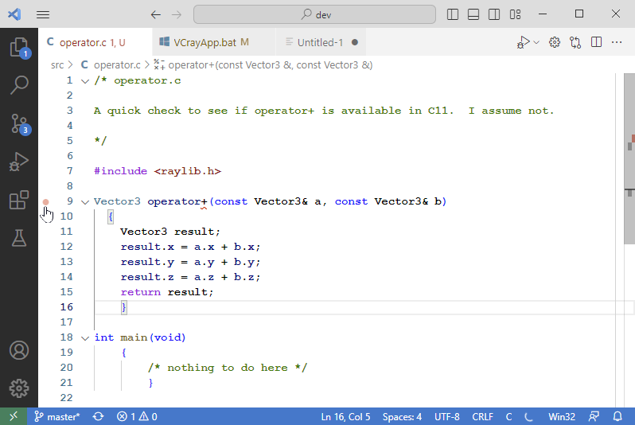

<!-- index.md 0.0.2                 UTF-8                          2023-04-15
     ----1----|----2----|----3----|----4----|----5----|----6----|----7----|--*

              FAILCODE5: PRODUCING/OPERATING %VCEXE% FAILED
     -->

# ***VCrayApp** [FAILCODE5: PRODUCING/OPERATING %VCEXE% FAILED](.)*

| ***[nfoTools](../../../../)*** | [dev](../../../)[>D211101](../../)[>fails](../)[>FAIL5](.) | [index.html](index.html) ***0.0.1 2023-04-15*** |
| :--                |       :-:          | --: |
|  | Work-in-Progress |  |
|              |                     |           |
| This Version | since VCrayApp 0.1.0 beta release | [D211101e](../../D211101e) |

`FAILCODE5`, and the companion `FAILCODE4`, are produced for a variety of
build and operation failures in operation of `VCrayApp.bat`.  If operation
is in terse (option `*`) mode, there may not be enough information about
the failure.  In that case, rerun `VCrayApp.bat` in verbose mode, using the
same parameters with out the `*`.

The `%VCEXE%` in an actual `FAILCODE5` report will be one of

* The executable (`%VCAPPEXE%`) specified for the project -- the most likely
case
* Different stages in building/refreshing the cache of raylib components
  * `VCrayVerCheck.exe`
  * `VCrayVer.bat`
  * `FAILCODE4` avoided before the next case
  * `VCrayConfirm.exe`

## %VCEXE% IS THE PROJECT EXECUTABLE (%VCAPPEXE% VALUE)

If [initial setup of VCrayApp](../../D211101a) has been successful, with
successful initialization/update of the VCrayApp cache,  error cases are
typically when compiling the project source code (`%VCAPPSRC%` location).

That's the case for the demonstration project with `%VCEXE%` of `operator.c`.

### Source-Code Compilation Diagnostics

Typically, the name of the file being compiled (here, `operator.c`) is named
by VC/C++ and any diagnostic messages will follow that name, as shown above.

Diagnostic messages can be cryptic.  However, there is key information.  Each
message indicates the file being processed (`operator.c`) and the number of
the line in that file (`(9)`) along with an error code and some explanatory
text.  These might not be particularly information.  They do provide places
to look in the code that is being compiled.

Although this is a contrived example, similar considerations will apply in other projects along with a great variety of diagnostic messages.

In line 9 of example `operator.c` viewed in Visual Studio Code, the difficulty
is with the "+" there.  This is signified by the underlining and also the dot
adjacent to the line.

The problem is that `operator` is not a keyword of C Language.  It is a C++
feature not supported in C.  This small program was written to confirm that.
It is unsurprising that the diagnostics do not recognize the actual fault,
reporting simply on the difficulty in terms of C Language syntax.

TIP.  Beside the (expected) diagnostics, the VS Code view of `operator.c` also
provides some affirmative detail.  VS Code is able to access `raylib.h` and
rely on its definitions.  The definition of `Vector3` is recognized and the
C/C++ Intellisense feature finds nothing objectionable except the suspicious
"+" on line 9.  It is valuable to notice that VS Code does not identify any
other concern.  (Without that "+" the code appears to be a legitimate
definition of a function named `operator`, although that usage is discouraged
for C Language because of its significance as a keyword in C++.)

### Project Link Errors

Link errors in the project technically arise from conflicts in the names of
external functions, the absence (or too many) of `main`, or even incompatible
components among those being linked.

In the last case, it is important that the same "x64 Developer Command Prompt"
be used every time VCrayApp is used.  Also, any time a new release (or `-dev`
update) is installed, it is important to rebuild the VCrayApp project's cache.

For understanding of the link process, review
[VCrayApp Operation](../../D211101b) as well as information on the
[VS Build Tools](https://orcmid.github.io/nfoTools/tools/T211002/).

----

Discussion about nfoTools is welcome at the
[Discussion section](https://github.com/orcmid/nfoTools/discussions).
Improvements and removal of defects in this particular documentation can be
reported and addressed in the
[Issues section](https://github.com/orcmid/nfoTools/issues).  There are also
relevant [projects](https://github.com/orcmid/nfoTools/projects?type=classic)
from time to time.

<!-- ----1----|----2----|----3----|----4----|----5----|----6----|----7----|--*

     0.0.2 2023-04-15T20:16Z Tidied Intermediate Draft
     0.0.1 2023-04-15T19:29Z Intermediate Review Draft
     0.0.0 2023-04-13T21:42Z Initial page from 0.0.0 FAIL3 boilerplate.

               *** end D211101/fails/FAIL5/index.md ***
     -->
