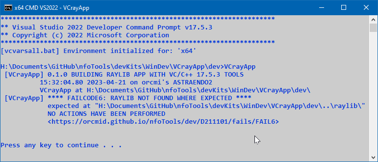

<!-- index.md 0.0.1                 UTF-8                          2023-04-23
     ----1----|----2----|----3----|----4----|----5----|----6----|----7----|--*

              FAILCODE6: RAYLIB NOT FOUND WHERE EXPECTED
     -->

# ***VCrayApp** [FAILCODE6: RAYLIB NOT FOUND WHERE EXPECTED](.)*

| ***[nfoTools](../../../../)*** | [dev](../../../)[>D211101](../../)[>fails](../)[>FAIL6](.) | [index.html](index.html) ***0.0.0 2023-04-22*** |
| :--                |       :-:          | --: |
|  | Work-in-Progress |  |
|              |                     |           |
| This Version | since VCrayApp 0.1.0 | [D211101e](../../D211101e) |

FAILCODE6 signifies that a released **source-code** version of raylib, in a
folder named `raylib\` is not positioned properly on the same drive and level
as the unzipped VCrayApp project.

The determination is that `raylib\src\raylib.h` does not exist using the
location described in the diagnostic message.

NOTE: If a clone of the raylib Github repository is used, the folder holding
the clone must be named `raylib` no matter what the clone is named.

See [VCrayApp Setup](../../D211101a) for more details.

----

Discussion about nfoTools is welcome at the
[Discussion section](https://github.com/orcmid/nfoTools/discussions).
Improvements and removal of defects in this particular documentation can be
reported and addressed in the
[Issues section](https://github.com/orcmid/nfoTools/issues).  There are also
relevant [projects](https://github.com/orcmid/nfoTools/projects?type=classic)
from time to time.

<!-- ----1----|----2----|----3----|----4----|----5----|----6----|----7----|--*

     0.0.1 2023-04-23T20:16Z Completed draft
     0.0.0 2023-04-22T02:45Z Boilerplate from 0.0.6 FAIL5.

               *** end D211101/fails/FAIL6/index.md ***
     -->
