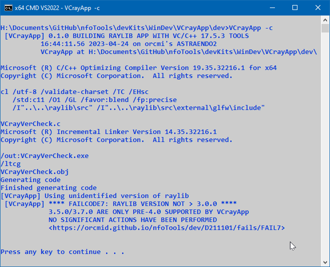

<!-- index.md 0.0.3                 UTF-8                          2023-04-29
     ----1----|----2----|----3----|----4----|----5----|----6----|----7----|--*

                    FAILCODE7: RAYLIB VERSION NOT > 3.0.0
     -->

# ***VCrayApp** [FAILCODE7: RAYLIB VERSION NOT > 3.0.0](.)*

| ***[nfoTools](../../../../)*** | [dev](../../../)[>D211101](../../)[>fails](../)[>FAIL7](.) | [index.html](index.html) ***0.0.3 2023-04-29*** |
| :--                |       :-:          | --: |
|  | Work-in-Progress |  |
|              |                     |           |
| This Version | since VCrayApp 0.1.0 | [D211101e](../../D211101e) |

VCrayApp is not workable with raylib-3.0.0 and older releases.  There is
no effort to support such older releases.  Releases in the 4.x series other
than 4.2 are now preferred.

## Background

Starting with raylib-4.0.0, the file `src\raylib.h` provides a version
preprocessor variable.

The small program `VCrayVerCheck.c` is compiled before
every cache refresh.  It checks `raylib.h` for that preprocessor variable.  If
it is not defined, `VCrayVerCheck` reports that the version is unidentified.
`VCrayApp.bat` acquires that result by piping the result of
`VCrayVerCheck.exe` into a small batch file, `cache\VCrayVer.bat`, that sets
`%VCRAYVER% to the particular case that VCrayVerCheck detects.

In the unidentifed case, `VCrayApp.bat` examines for the presence and absence
of some `raylib\` files that differ among pre-4.0 raylib releases.  That is
how versions 3.5 and 3.7 are identified and accepted for cache construction.
All other unidentified cases lead to `FAILCODE7`.

For identified versions, `VCrayApp.bat` will present [FAILCODE8](..\FAIL8) for
specific versions of raylib that are known to be unusable with Visual Studio
Build Tools.  Otherwise, compiling of the cache of raylib components will
proceed.

----

Discussion about nfoTools is welcome at the
[Discussion section](https://github.com/orcmid/nfoTools/discussions).
Improvements and removal of defects in this particular documentation can be
reported and addressed in the
[Issues section](https://github.com/orcmid/nfoTools/issues).  There are also
relevant [projects](https://github.com/orcmid/nfoTools/projects?type=classic)
from time to time.

<!-- ----1----|----2----|----3----|----4----|----5----|----6----|----7----|--*

     0.0.3 2023-04-29T17:13Z Touch-ups
     0.0.2 2023-04-25T01:20Z Fix image URL
     0.0.1 2023-04-25T00:16Z First full draft
     0.0.0 2023-04-23T19:57Z Boilerplate from 0.0.0 FAIL6.

               *** end D211101/fails/FAIL7/index.md ***
     -->
