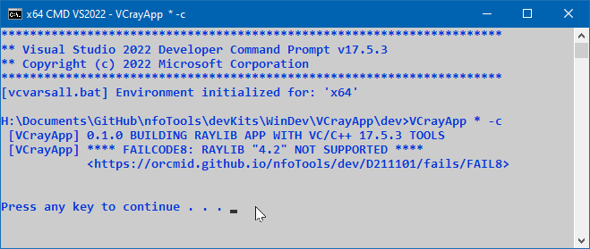

<!-- index.md 0.0.1                 UTF-8                          2023-04-24
     ----1----|----2----|----3----|----4----|----5----|----6----|----7----|--*

                    FAILCODE8: RAYLIB %VCRAYVER% NOT SUPPORTED
     -->

# ***VCrayApp** [FAILCODE8: RAYLIB %VCRAYVER% NOT SUPPORTED](.)*

| ***[nfoTools](../../../../)*** | [dev](../../../)[>D211101](../../)[>fails](../)[>FAIL8](.) | [index.html](index.html) ***0.0.0 2023-04-23*** |
| :--                |       :-:          | --: |
|  | Work-in-Progress |  |
|              |                     |           |
| This Version | since VCrayApp 0.1.0 | [D211101e](../../D211101e) |

The first use of FAILCODE8 is for raylib-4.2.0.  There is a defect in an
external dependency that prevents compilation of the complete cache.  The
corrected external dependency is incorporated in raylib-4.5.0.

There will be no correction.

The `raylib\` should be replaced with either 4.0.0 or 4.5.0, neither of which
has the problem.

This message will also be used if there are releases beyond 4.5.0 that cannot
be cached using the Visual Studio Build Tools.

See [VCrayApp Setup](../../D2211101a) for further information on acceptable
versions of raylib as well as later versions of VCrayApp and Visual Studio
Build Tools that may work better.
----

Discussion about nfoTools is welcome at the
[Discussion section](https://github.com/orcmid/nfoTools/discussions).
Improvements and removal of defects in this particular documentation can be
reported and addressed in the
[Issues section](https://github.com/orcmid/nfoTools/issues).  There are also
relevant [projects](https://github.com/orcmid/nfoTools/projects?type=classic)
from time to time.

<!-- ----1----|----2----|----3----|----4----|----5----|----6----|----7----|--*

     0.0.1 2023-04-24T02:10Z Complete draft
     0.0.0 2023-04-23T20:01Z Boilerplate from 0.0.0 FAIL7.

               *** end D211101/fails/FAIL8/index.md ***
     -->
