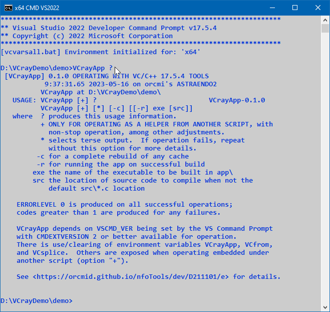

<!-- index.md 0.0.20                UTF-8                          2023-05-17
     ----1----|----2----|----3----|----4----|----5----|----6----|----7----|--*

               VCRAYAPP: VC/C++ COMMAND-LINE RAYLIB APP DEVKIT
     -->

# ***D211101** [VCrayApp: VC/C++ Command-Line raylib App DevKit](.)*

| ***[nfoTools](../../)*** | [dev](../)[>D211101](.) | ***[index.html](index.html) 0.0.20 2023-05-17*** |
| :--                |       :-:          | --: |
|  | Work-in-Progress |  |

VCrayApp is a project-folder organization that is useful for creating
Microsoft Windows programs using the
[`raysan5/raylib`](https://www.raylib.com/) library for graphical
applications.

Initial VCrayApp project-folder setup includes confirmation of correct
operation that can then be confidently customized for a new project.

## 1. Overview

VCrayApp provides compilation of raylib apps using the Microsoft Visual
C/C++ command-line compiler, `CL.exe`, along with other freely-available
developer tools, including others from Microsoft.

If VCrayApp is found incorporated in a larger project, check for any
custom instructions that apply to specific usage in that project.

### 1.1 Project Files Organization

The expected setup for a VCrayApp-organized project of your own is with the
following folder structure (since VCrayApp-0.1.0):

```text
    your-development-files-location\
     |- raylib\                   // folder where raylib release *source* is
     :  ...                       //    extracted
     |- VCrayApp-*semver*.zip     // at the same level, same drive as raylib\
     |- YOUR-PROJECT-FOLDER\      // unzipped VCrayApp-*semver*-folder-renamed
         |- .vscode\              // suggested .vscode settings
         |- app\                  // folder your App is compiled to
         |- cache\                // folder of VCrayApp resources and cached
         |                        //    raylib components
         |- src\                  // recommended location for your source-code
         |                        //    *.c files and header/include files
         |- NOTICE.txt            // licensing and origin of the content
         |                        //    from VCrayApp-*semver*.zip itself
         |- CHANGES-*semver*.txt  // changes from any earlier versions
         |- VCrayApp.bat          // the batch script for compiling your app
         |- VCrayApp-*semver*.txt // *semver* version synopsis and manifest

```

[Semantic versioning](https://semver.org/) is used.  E.g., the Alpha release
had *semver* 0.0.0 and was packaged in `VCrayApp-0.0.0.zip`.  Starting with
*semver* 1.0.0 further breaking changes will require a change at the major
level, with feature additions at 1.*x*.0 levels and fixes at 1.*x*.*y* levels.
The subfolders, `.vscode`, `app\`, `cache\` and `src\` include explanatory
`*.txt` files with regard to the VCrayApp purposes for them.

It is recommended that  `src\` be for your own source code and `app\` include
any resources that will be distributed with and accessed by the compiled
`.exe`.

Code examples, other projects, and related tutorials will further demonstrate
the VCrayApp arrangement.

Details of this organization and structure of the individual
subfolders is provided in [D211101a: VCrayApp Setup](a).

### 1.2 VCrayApp.bat

Builds of your VCrayApp project's code are by performing `VCrayApp.bat` from
a developer command prompt.  The `.bat` script will report progress through
build stages and also provide diagnostic messages concerning any failures
that occur in the `.bat` operation.

On initial operation of VCrayApp, `VCrayApp.bat` will verify the setup,
compile raylib components into `cache`, and then demonstrate operation by
compiling and operating program `VCrayConfirm`.  This procedure will be
performed each time the cache is rebuilt as well as after any failure in
having a working cache of raylib components.

Performing command "`VCrayApp ?`" from a developer command prompt focused on
your project folder will provide usage information.



Further details of VCrayApp operation are provided in
[D211101b: VCrayApp Operation](b).

## 2. Prerequisites and Dependencies

**NOTE:** Current materials are now at the *beta* level, with the
[VCrayApp 0.1.0](e/) release.  It is available for early usage while support
materials are updated or added.  There will be improved support for novice
developers, including demonstration of raylib examples.

For novice developers, the creation of raylib applications can be carried out
by compiling the many available `raylib\examples` and finding additional
explanations for the minimum prerequisites.  For self-study, other resources
should be used to develop familiarity and confidence in the tools to be
mastered.

***SUCCESSFUL USE OF VCrayAPP REQUIRES CONFIDENT USE OF C LANGUAGE AND A
C/C++ LANGUAGE COMPILER*** for creation of clean programs involving source
files, include files, and the interfaces (APIs) of standard libraries as well
as the special-purpose raylib libraries.  For more on C Language see
[T060101: C/C++ Programming](https://orcmid.github.io/nfoTools/tools/T060101/).

It is assumed that Microsoft Windows 7 Professional or later are used.
Thorough VCrayApp testing is with Microsoft Windows 10 latest versions.

Development with VCrayApp and illustration of usage involves the following
tools along with confident use of C Language:

* Windows File Explorer
* Windows Built-in Zip-Folder Tool
* [Visual Studio Native Build Tools](https://orcmid.github.io/nfoTools/tools/T211002/)
* [Developer Command Prompt](https://orcmid.github.io/nfoTools/tools/T060501/)
* VC/C++ Command Line Compiler, `CL.exe`
* raylib *source* code *release* downloaded, unzipped, and renamed `raylib\`
* a text editor for editing of project files (Visual Studio Code recommended)

----

* Git4Win implementation for source-code control and backup
* TortoiseGit for File Explorer integration of Git
* GitHub Windows Client for public access to your and other development
  projects
* GPG4Win for creation and verification of digital signatures

The first seven are essential.  The remainder or equivalents are recommended.
For further details on dependencies, see
[VCrayApp Setup](a/) and [VCrayApp Operation](b/).  Additional
usage of VCrayApp is covered with
[VCrayApp Verification/Deployment Lifecycle](c).

VCrayApp is designed to work with versions of Visual Studio that are free
for personal use, including the Visual Studio Build Tools (recommended)
and the Visual Studio Community editions.  Additional levels of Visual
Studio can also be used, all via their Native Tools Command Prompt.

No use is made of Visual Studio projects, solutions, and the conventional
separation of debug and release builds.  With nfoTools, emphasis is on
testing and confirmation with the same program that is provided to users
along with built-in troubleshooting support as needed.  There are additional
tips in the available materials.

## 3. Available Materials

| **ID** | **Started** | **Status** | **Topic** |
|   :-:   |   :-:   |  :-:   |  ---  |
| [D211101a](a/) | 2022-08-18 | placeholder | VCrayApp Setup |
| [D211101b](b/) | 2022-08-18 | placeholder | VCrayApp Operation |
| [D211101c](c/) | 2022-08-21 | placeholder | VCrayApp Verification/Deployment Lifecycle |
| [D211101f](f/) | 2023-04-07 | 0.0.8 2023-05-15 | VCrayApp FAILCODE Messages |
|                       |            |                  |     |
| [D211101e](e/) | 2023-04-10 | 0.0.3 2023-05-09 | VCrayApp 0.1.0 (beta) |
| [D211101d](D211101d/) | 2022-10-26 | 0.0.9 2023-05-17 | VCrayApp 0.0.0 (alpha) |

## 4. Development

Development within the GitHub
[orcmid/nfoTools](https://github.com/orcmid/nfoTools) project is at the
[devKits/WinDev/VCrayApp](https://github.com/orcmid/nfoTools/tree/master/devKits/WinDev/VCrayApp)
main branch.

### 4.1 Principles

* Operation with freely-available and free-to-use development tools.
* Safe for novice developers and others keen to develop games and graphical
  applications on native Windows.
* Simple manual instructions for free-standing use and for incorporation
  in projects designed for novice and advanced usage.
* Sufficient for expert incorporation inside more-elaborate construction sets.
* Designed for confirmation of operation and confident employment.

### 4.2 Plan

* Develop VCrayApp on GitHub as part of the nfoTools project.
* Provide pilot demonstration in confirmation of raylib examples.
* Release alpha and beta versions for confirmation and early-adopter trial.
* Include confirmation materials and approaches.
* Deal with levels of prerequisite and progressive disclosure.
* Address life-cycle issues with respect to VCrayApp and interdependency with
  raylib releases.
* Address usage with raylib work-in-progress for raylib contributors.

----

Discussion about nfoTools is welcome at the
[Discussion section](https://github.com/orcmid/nfoTools/discussions).
Improvements and removal of defects in this particular documentation can be
reported and addressed in the
[Issues section](https://github.com/orcmid/nfoTools/issues).  There are also
relevant [projects](https://github.com/orcmid/nfoTools/projects?type=classic)
from time to time.

<!-- ----1----|----2----|----3----|----4----|----5----|----6----|----7----|--*

     0.0.20 2023-05-17T18:11Z Final VCrayApp-0.0.0 change
     0.0.19 2023-05-16T16:48Z Pre-release VCrayApp-0.1.0
     0.0.18 2023-05-07T20:30Z Adjust to changes in subfolder locations
     0.0.17 2023-05-06T15:47Z Correct section numbering
     0.0.16 2023-04-30T17:42Z More Touch-ups
     0.0.15 2023-04-29T19:44Z Staging for 0.1.0 release
     0.0.14 2023-03-30T18:58Z Reflect D211101d 0.0.8
     0.0.13 2023-02-10T18:50Z Touch up, correcting d211101c designation
     0.0.12 2023-01-14T23:38Z Small adjustments and disclaimer about *alpha*
     0.0.11 2023-01-13T01:37Z Reflect updated D211101d
     0.0.10 2023-01-12T17:19Z Redefine D211101c, small touch-up
     0.0.9 2023-01-12T05:17Z Update D211101d status, add NOTICE.txt to map
     0.0.8 2023-01-02T22:04Z Adjust Available Materials
     0.0.7 2023-01-02T18:56Z Smoothing of text, more-consistent terminology
     0.0.6 2022-08-19T21:46Z Corrections and touch-ups
     0.0.5 2022-08-18T20:16Z Touch-up, and Available Materials and other links
     0.0.4 2022-08-16T22:44Z Add Introductory Materials
     0.0.3 2022-06-11T21:25Z Introduce Standard Top banner
     0.0.2 2022-06-10T02:38Z Correct mouse track
     0.0.1 2022-06-10T02:28Z Touch-ups and confirmation of material
     0.0.0 2022-06-10T00:16Z Placeholder for initial development of a complete
           folio

                 *** end of docs/dev/D211101/index.md ***
     -->
