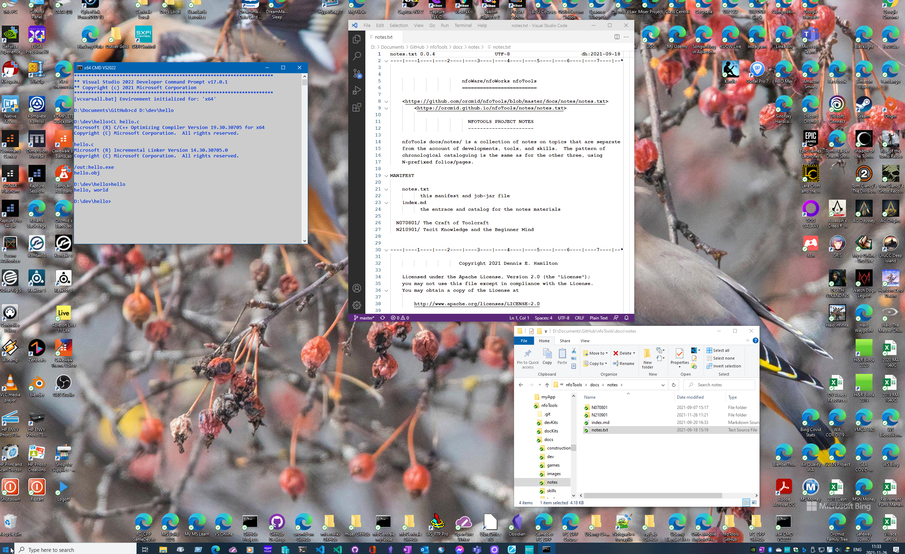
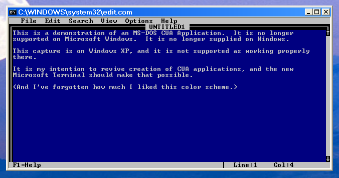
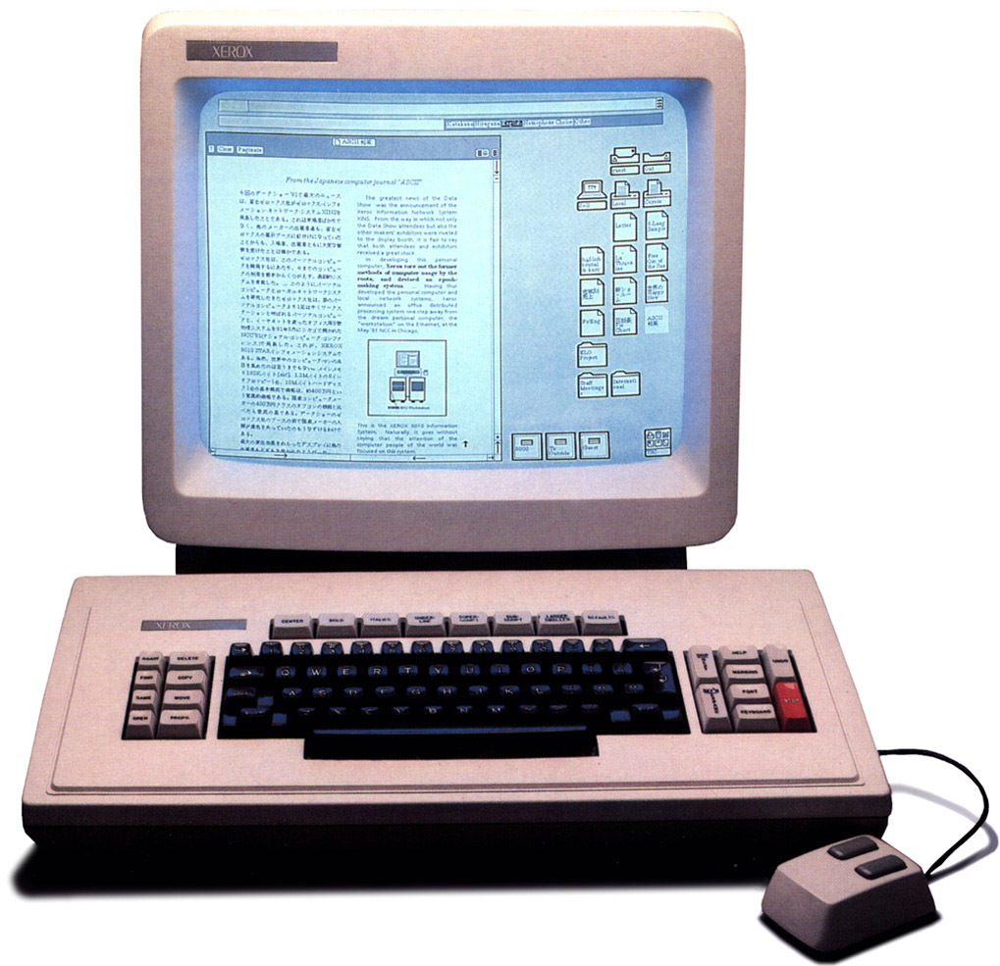
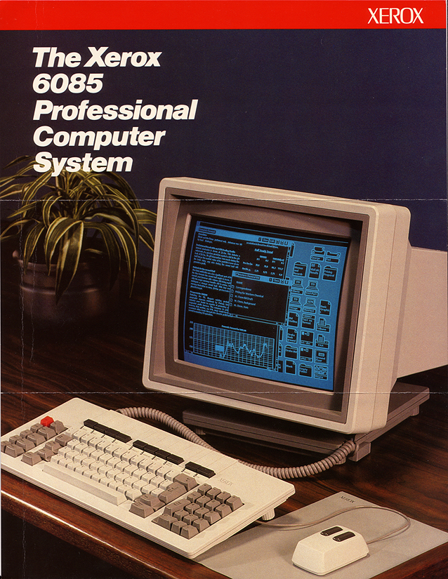

<!-- index.md 0.0.2                 UTF-8                          2022-03-04
     ----1----|----2----|----3----|----4----|----5----|----6----|----7----|--*

                          N220201a: NOT YOUR DESKTOP
     -->

# ***N220201a:** Not Your Desktop*

| ***[N220201](.)*** | [notes](../)[>N220201](.)[>N220201a](N220201a.md) | ***0.0.2 2022-03-02*** |
| :--                |       :-:          | --: |
|  | Work-in-Progress |  |

Perhaps one of the most distinctive tacit arrangements by experienced users
of Windows PCs is the setup of their desktop display.  I am no different.  And
my approach has been continued and refined for over 40 years.  Even if I use
only a fragment of my PC desktop in an illustrative screen capture, there is
far too much that may be unfamiliar to my intended audience.

## This Desktop is Not Yours

I would not ordinarily attempt to present my entire desktop display in
apart from making this particular illustration.  Although the file that
is shown has all of the bits in full-size detail, the browser presentation
is down-sized and degraded.  That's a common mistake made
in providing screen captures.  If used in a tutorial
or a problem report, an observer may have no means to recognize an important
detail, a detail that is obliterated in the rendering.  I know not to do that.

Without context, this image is more confusing than informative, despite, or
maybe because of, the explanatory text.  There are incidental aspects that
may distract others yet are second-nature and invisible to me without careful
beginner mind.

In making smaller, more-focused screen captures, there is still reflection of
my particular configuration and it can introduce confusing unfamiliarity
to a beginner.  Also, in making focused captures I can fail to connect the
dots between how someone else could get to the equivalent place on their own
PC.  It is important to figure out how to provide the necessary guardrails
while not discouraging the impatient more-expert folk.

I seek a balanced approach that leaves noone behind, yet allows more-expert
visitors enough short-cuts to satisfy their level of curiosity.

## Providing Recognizable Desktop Operation

TBD

## How Did We Get Here?

I'm attached to the size of my Windows PC desktop, providing 2560 x 1600
full-color pixels on a 30" monitor.  This is the culmination of over 30 years
of organizing desktop computer displays.  It's also great for PC games and
streaming videos.

My first sustained experience of the desktop GUI model was at the start of my
second tour at Xerox Corporation.  Although I had seen the Xerox Alto in the
late 70s, my return 10 years later exposed me to Xerox Desktop computers
everywhere, starting with the Xerox 8010.

These computers were everywhere inside the company.  Although engineers would
treasure their Sun Microsystem workstations, and there was extensive use of
multi-processor mainframe configurations, desk workers elsewhere in the
business had these systems all on local area networks and connected to laser
printers.  Xerox Corporation was dog-fooding its view of the Office of the
Future, including global connections via a proprietary network service stack.

The Xerox 8010 was rather sluggish, the ambitions of the software
over-powering the capabilities of the processor (a proprietary Xerox chip set)
and the hard drive.

There was extensive effort to upgrade to the more powerful Xerox 6085 in the
company.

I was very pleased to have that new desktop power.  The arrangement of icons
away from an area in which documents and other applications could have their
windows stacked is apparent.  Our displays were larger than the one portrayed
and an around-the-fringes organization of icons became my habit.

That approach is evident in my Windows 10 Desktop.  One ambition for the 30"
monitor is to be able to work with documents opened side-by-side for editing
and other purposes.  I am doing that as I edit this page.

## Related Material

| **ID** | **Started** | **Status** | **Topic** |
|   :-:   |   :-:   |  :-:   |  ---  |
| [N220201](..) | 2022-02-25 | current | Beginner Mind Failures |

----

Discussion about nfoTools is welcome at the
[Discussion section](https://github.com/orcmid/nfoTools/discussions).
Improvements and removal of defects in this particular documentation can be
reported and addressed in the
[Issues section](https://github.com/orcmid/nfoTools/issues).  There are also
relevant [projects](https://github.com/orcmid/nfoTools/projects) from time to
time.

<!-- ----1----|----2----|----3----|----4----|----5----|----6----|----7----|--*

     0.0.2 2022-03-04T21:47Z More smoothing, the edit CUA no-context example
     0.0.1 2022-03-01T18:05Z Smooth and add Xerox 8010/6085 coverage
     0.0.0 2022-02-28T18:17Z Clone and adapt N220201 index.md

               *** end of docs/notes/N220201/N220201a.md ***
     -->
