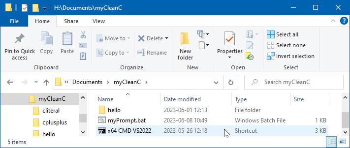
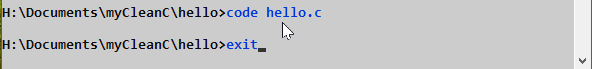
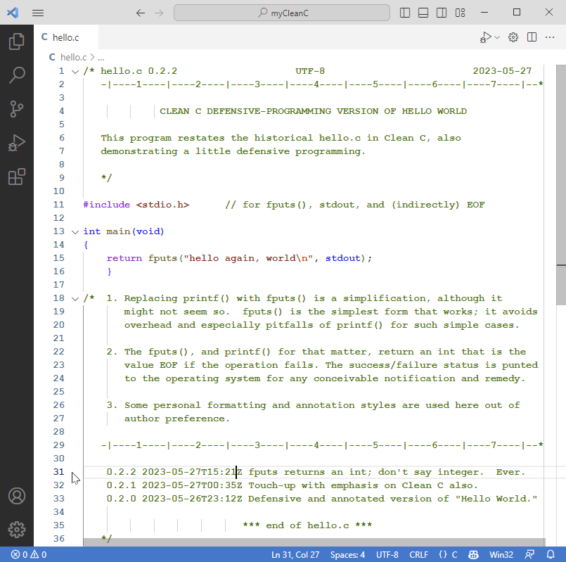

<!-- index.md 0.0.7                UTF-8                          2023-05-29
     ----1----|----2----|----3----|----4----|----5----|----6----|----7----|--*

                         T060101c: GETTING TO "HELLO"
     -->

# T060101c: [Getting to "Hello"](.)

| ***[nfoTools](../../../)*** | [tools](../../)[>t060101](../)[>c](.) | ***[index.html](index.html) 0.0.7 2023-05-29*** |
| :--                |       :-:          | --: |
|  | [Work in Progress](T060101c.txt) |  |

C Language has a famous first program.  Creating and operating that program is demonstrated, with links to expanded detail that may be needed.

- [T060101c: Getting to "Hello"](#t060101c-getting-to-hello)
  - [1. Install C/C++ Compiler Software](#1-install-cc-compiler-software)
  - [2. Make a Folder for the Work](#2-make-a-folder-for-the-work)
  - [3. Make the `hello.c` Code](#3-make-the-helloc-code)
  - [4. Initiate a Command Prompt](#4-initiate-a-command-prompt)
  - [5. Compile and Run the Program](#5-compile-and-run-the-program)
    - [5.1 Get Situated](#51-get-situated)
    - [5.2 Navigate to `myCleanC`](#52-navigate-to-mycleanc)
    - [5.3 Compile `hello.c`](#53-compile-helloc)
    - [5.4 Observe the compilation](#54-observe-the-compilation)
    - [5.5 Execute the resulting program](#55-execute-the-resulting-program)
    - [5.6 Look around in `myCLeanC`](#56-look-around-in-mycleanc)
    - [5.7 `exit` command](#57-exit-command)
  - [6. Looking Down the Road](#6-looking-down-the-road)
    - [6.1 Improved project file organization](#61-improved-project-file-organization)
    - [6.2 Customized Command Prompt operation](#62-customized-command-prompt-operation)
    - [6.3 Incorporation of Visual Studio Code](#63-incorporation-of-visual-studio-code)

## 1. Install C/C++ Compiler Software

There is not far to get without having software that compiles C Language
files into programs that run on the computer.  In this sketch,
[Visual Studio Build Tools](../../T211002/) are installed and ready for use.

## 2. Make a Folder for the Work

Create a computer folder for holding your work.  It can be tentative for now.
Have it in a place for personal data, not in any folder where software is
installed.  On a Windows PC, the Documents folder of a personal account will
 work; and that's preferable on a PC that is shared with others.

 

 The example `Documents\myCleanC` folder is established using a Windows 10
 File Explorer view that is handy when working on software projects.  The file
 `hello.c` has already been created there.  This is a text file with extension
 `.c` instead of `.txt`.

## 3. Make the `hello.c` Code


This is the very first program presented in the
\[[Kernighan1988](..\b\#Kernighan1988)\] book, *The C Programming Language*.
This program should be typed exactly and saved as file `hello.c`.  Be exact, character-by-character, line-by-line.

There is
[Hello World lore](https://en.wikipedia.org/wiki/%22Hello,_World!%22_program)
on all of the ways this "first program" has been accomplished.

## 4. Initiate a Command Prompt

In the All Programs option on the Windows Start Menu, find the Visual Studio
folder and expand it ("v") to find the "x64 Native Tools Command Prompt ..."
or equivalent wording.  The key element is "x64 Native."  Click that entry.


## 5. Compile and Run the Program

A console window (sometimes called a terminal) will be opened on the desktop.
There is identification of initialization as a Command Prompt in this case.
Commands are entered, step by step.


### 5.1 Get Situated


Selecting `x64 Native Tools Command Prompt` brings up a console window and
runs scripts that announce the tools and initialize the command session
environment for building x64 programs.

- The title in the console window reflects the established setup.  The `C:\_`
identifies the built-in utility `CMD.exe` that provides Command Prompt
operation.
- The version of Visual Studio whose Build Tools are being employed is
identified.
- The flavor of environment initialized is reported and the first user
command is solicited.

### 5.2 Navigate to `myCleanC`

The default prompt format consists of the file-explorer location (the
Current Directory or CD) followed by `>`.  Commands are typed after
the `>` of a prompt from the computer.


The Developer Command Prompt starts at the location of the build tools, not
where the project is.  The command `cd /D H:\Documents\myCleanC` changes the
CD to drive and directory where `hello.c` is stored.

### 5.3 Compile `hello.c`


The command `CL hello.c` instructs the VC/C++ Compiler-Linker (CL) to compile
`hello.c`.  In this simple case, compilation of the one file and producing
executable program `hello.exe` will be automatic.

### 5.4 Observe the compilation

If your `hello.c` is **exactly** the version shown in
[3](#3-make-the-helloc-code) above, the compiler
identification should be followed by the name of the file, `hello.c` to be
compiled and there should be nothing more before the Incremental Linker is
identified.

If there is anything else instead, there will be some diagnostic messages
identifying the difficulties.  Any difficulties must be resolved and the
process begun anew, step by step from [4](#4-initiate-a-command-prompt),
above.


After the linker identification, there will be automatic determination to
produce `hello.exe` from the file `hello.obj` that was produced by the
successful compile of `hello.c`.

If there were diagnostic messages about linking problems, they would
appear before the next prompt.  That's unlikely here.  It can be expected
to happen in future situations.

### 5.5 Execute the resulting program

There being no misadventures, the file `hello.exe` is there in `myCleanC`.


The `hello.exe` program becomes available as a new command.  The program is
requested with command `hello` and Windows will detect `hello.exe` in the
current directory and operate it there.

In this case, the `hello.c` `printf()` output will be directed to the Command
Prompt screen as a line of text.

### 5.6 Look around in `myCLeanC`


Finally, command line `H:\Documents\myCleanC\dir` issues the command for
listing the current content of the Current Directory.

The file `hello.obj` was produced by the compiler processing of `hello.c`.
That `hello.obj` intermediate is taken by the linker and combined with needed
library and setup code to produce `hello.exe`.  The `hello.exe` program is the complete native software for carrying out the operation specifed in the
C Language of `hello.c`.

The simple 67-character `hello.c` is compiled to a 2,367 byte `hello.obj` of
native computer code and information on what libraries it depends on.  The
final `hello.exe` is 137,728 bytes of complete executable-format
code.  It is constructed to be run from a command prompt, just like a built-in
command.

### 5.7 `exit` command

End the Command Prompt session with the command `exit`.

## 6. Looking Down the Road

With practice and increasing proficiency, there will be improvements in the
cycle of programming, compiling, and confirmation.  Along the way there will
be ways to have project work go more smoothly.

### 6.1 Improved project file organization

To collect projects together in a handy place, the `myCleanC\` folder is
changed to have individual sub-folders for different programs, starting
with `myCLeanC\hello\`.



Along with this, a shortcut is created for creation of the Command Prompt
directly at `myCleanC\`.  This will be handy for workng on all of the projects
that will be placed under `myCleanC\`.

A new Command Prompt right there is initiated by double-clicking the shortcut.

### 6.2 Customized Command Prompt operation


As can be seen in this session, the initialized Command Prompt starts
directly at `myCleanC` and it is a short hop to the `hello` project.

The change in appearance is accomplished by customizing the shortcut.  There
are many choices available.  It is also possible to alter the prompt text,
choosing something different than `H:\Documents\myCleanC>`.

The change in the directory reflects changes in the `hello.c` program, which
have the file be more verbose.  Yet the `hello.obj` and `hello.exe` files are
smaller than at [5.6](#56-look-around-in-mycleanc), above.

There is also a new component, the subdirectory `.vscode\`.  This is entirely
for use in conjunction with Visual Studio Code and need not be of any concern.
It only has effect when Visual Studio code is opened on the `hello\` folder.

### 6.3 Incorporation of Visual Studio Code



The command entry `code .` initiates [Visual Studio Code](../../T21001/) for
operation in the Command Prompt environment and oriented to the Current
Directory (established by the `.` parameter).

 The benefit of initiating VS Code in this manner is for its
 recognition of the initialized environment, using it for review and
 annotation of files that are opened for review and possible editing.

 

 All of the green text is commentary.  Only lines 11-16 provide the C Language
 code.

 The color highlighting is provided automatically as readability hints of the
 program's C Language structure.

 The `hello.c` program is now in Clean C.  What makes the difference is the
 first line,

 ```C
 int main(void)
 ```

 Visual Studio Code will recognize various defects in a C Language program.
 For this `hello.c` none are identified.

 What will become more important is coming to appreciate what is **not**
 provoking any VS Code commentary.

 - The ```include <stdio.h>``` has been resolved to a file in the VC/C++
 environment.
 - The `int main(void)` is recognized as the beginning of a valid main
 function.
 - the `fputs()` matches with the definition in `stdio.h` and the two parameters
 are of the proper form.
 - `stdout` is recognized as the indicator of the standard output stream,
 usually the current Command Prompt position, also established in `stdio.h`.

 All of this built-in checking, called
 [IntelliSense](https://code.visualstudio.com/docs/editor/intellisense),
 will be valuable as more programs are developed.

----

Discussion about nfoTools is welcome at the
[Discussion section](https://github.com/orcmid/nfoTools/discussions).
Improvements and removal of defects in this particular documentation can be
reported and addressed in the
[Issues section](https://github.com/orcmid/nfoTools/issues).  There are also
relevant [projects](https://github.com/orcmid/nfoTools/projects?type=classic)
from time to time.

<!-- ----1----|----2----|----3----|----4----|----5----|----6----|----7----|--*

     0.0.7 2023-05-29T21:45Z Improved point-by-point explanations
     0.0.6 2023-05-28T23:56Z Draft completed after proof-checking
     0.0.5 2023-05-28T23:17Z Touch-up cross-references
     0.0.4 2023-05-28T20:14Z First full draft
     0.0.3 2023-05-27T21:47Z First draft, sections 1-5
     0.0.2 2023-05-20T23:05Z Touch-ups for T060101/c/ transposition
     0.0.1 2022-06-16T23:14Z improve title header strip
     0.0.0 2021-11-25T00:20Z bootstrap placeholder and boilerplate

               *** end of docs/tools/T060101/c/index.md ***
     -->
