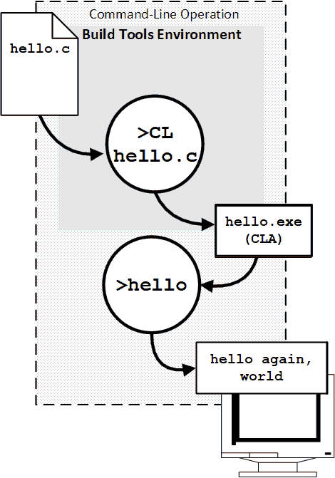
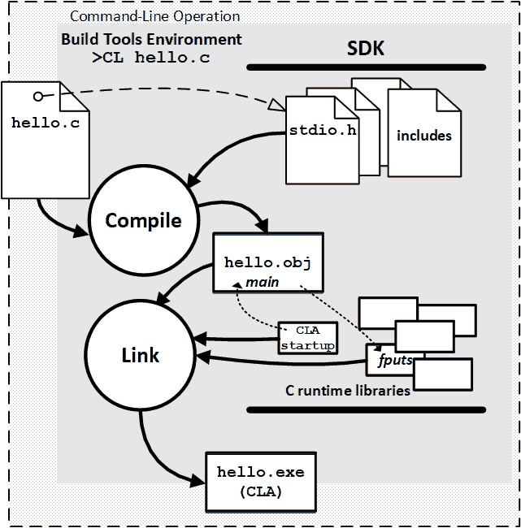

<!-- index.md 0.0.3                 UTF-8                          2023-06-12
     ----1----|----2----|----3----|----4----|----5----|----6----|----7----|--*

                   T060101d: HELLO, WHAT'S HAPPENING HERE?
     -->

# T060101d: [Hello, What's Happening Here?](.)

| ***[nfoTools](../../../)*** | [tools](../../)[>t060101](../)[>d](.) | ***[index.html](index.html) 0.0.3 2023-06-12*** |
| :--                |       :-:          | --: |
|  | [Work in Progress](T060101d.txt) |  |

- [T060101d: Hello, What's Happening Here?](#t060101d-hello-whats-happening-here)
  - [1. Overall Operation](#1-overall-operation)
  - [2. Compile and Link](#2-compile-and-link)

## 1. Overall Operation

The overall objective is to convert single-file program, `hello.c`,
into a program, `hello.exe`, that can be run directly on the computer.  There
is a simple pattern using the
[command-line interface](https://en.wikipedia.org/wiki/Command-line_interface)
that is initiated along with the
[Developer Command Prompt](https://learn.microsoft.com/en-us/visualstudio/ide/reference/command-prompt-powershell)'s
initialization of a build tools environment.

The diagrammatic view, below, parallels the observed command-line operation in
[Getting to "Hello"](../c/#62-customized-command-prompt-operation).  This is a
generall pattern, using the specific example of `hello.c` for clarity.

Two command-line operations are performed.

- `>CL hello.c` to compile the file `hello.c` into the program file
`hello.exe` without error
- `>hello` to operate `hello.exe`, providing its output directly in the
command-line interface

**The Key Idea**. `hello.exe` is independently-usable repeatedly, while having
to be compiled only once.  The program can be used by others without building
it or even knowing how.

With the simple `>CL hello.c` command, The `hello.exe` program is
automatically produced as a Command-Line Application (CLA).  The program is
completely self-contained, although limited to operation with a command-line.

**An Experiment**.  From the File Explorer, double-click on the `hello.exe`
entry.  A command-line interface will open automatically, the program will
run, and the command-line interface will exit.  The can happen so rapidly
that it might not be observed at all, as if nothing happened.  For now, simply
open a [command prompt](../../T060501/) first.

Later, there will be ways to have operation be accomplished more smoothly.

## 2. Compile and Link

The Build Tools program, `CL` operates as a precision multi-tool.  It has many
options and stages of operation.  A fundamental pattern is separation of
compiling into two stages, one of compiling from source code followed by one
that links modules of code from many sources into a single executable, such as
`hello.exe`.

---

Discussion about nfoTools is welcome at the
[Discussion section](https://github.com/orcmid/nfoTools/discussions).
Improvements and removal of defects in this particular documentation can be
reported and addressed in the
[Issues section](https://github.com/orcmid/nfoTools/issues).  There are also
relevant [projects](https://github.com/orcmid/nfoTools/projects?type=classic)
from time to time.

<!-- ----1----|----2----|----3----|----4----|----5----|----6----|----7----|--*

     0.0.3 2023-06-12T20:20Z Touchup, starting "2. Compile and Link"
     0.0.2 2023-06-11T16:48Z Improve with "1. Overall Operation" redrawn
     0.0.1 2023-06-08T20:41Z Add "The Simple Process" draft section
     0.0.0 2023-06-07T19:38Z Placeholder morphed from 0.1.0 T060101c index.md

                *** end of docs/tools/T060101/d/index.md ***
     -->
