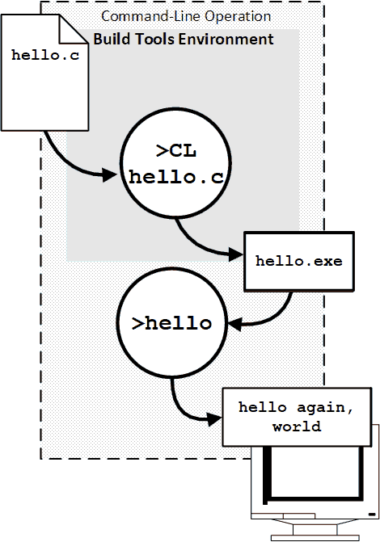

<!-- index.md 0.0.1                 UTF-8                          2023-06-08
     ----1----|----2----|----3----|----4----|----5----|----6----|----7----|--*

                   T060101d: HELLO, WHAT'S HAPPENING HERE?
     -->

# T060101d: [Hello, What's Happening Here?](.)

| ***[nfoTools](../../../)*** | [tools](../../)[>t060101](../)[>d](.) | ***[index.html](index.html) 0.0.0 2023-06-07*** |
| :--                |       :-:          | --: |
|  | [Work in Progress](T060101d.txt) |  |

C Language has a famous first program.  Creating and operating that program is demonstrated, with links to expanded detail that may be needed.

- [T060101d: Hello, What's Happening Here?](#t060101d-hello-whats-happening-here)
  - [1. The Simple Process](#1-the-simple-process)

## 1. The Simple Process

The overall object, using the single-file program, `hello.c` is to convert it
into a program that can be run on the computer.  There are essentiall two
steps.

With operation in a Command Prompt initialized with a Build Tools Environment,
the two steps are

- `>CL hello.c` to compile the file `hello.c` into the program file
`hello.exe` without error
` `>hello` to operate `hello.exe` as a command-line program, obtaining the
message build into the code.

There many other details, some presented as compilation progressed, others
internal to that progression.

The `hello.exe` program was compiled to be operated on a command-line. The
`hello.exe` program is self-contained, although it must be operated under
a command prompt.  There will ways to arrange for that operation to be done
smoothly.

For now, explore deeper into compilation process and how larger
programs can be organized in C Language modules and libraries for
more-elaborate construction and operation.

----

Discussion about nfoTools is welcome at the
[Discussion section](https://github.com/orcmid/nfoTools/discussions).
Improvements and removal of defects in this particular documentation can be
reported and addressed in the
[Issues section](https://github.com/orcmid/nfoTools/issues).  There are also
relevant [projects](https://github.com/orcmid/nfoTools/projects?type=classic)
from time to time.

<!-- ----1----|----2----|----3----|----4----|----5----|----6----|----7----|--*

     0.0.1 2023-06-08T20:41Z Add "The Simple Process" draft section
     0.0.0 2023-06-07T19:38Z Placeholder morphed from 0.1.0 T060101c index.md

                *** end of docs/tools/T060101/d/index.md ***
     -->
