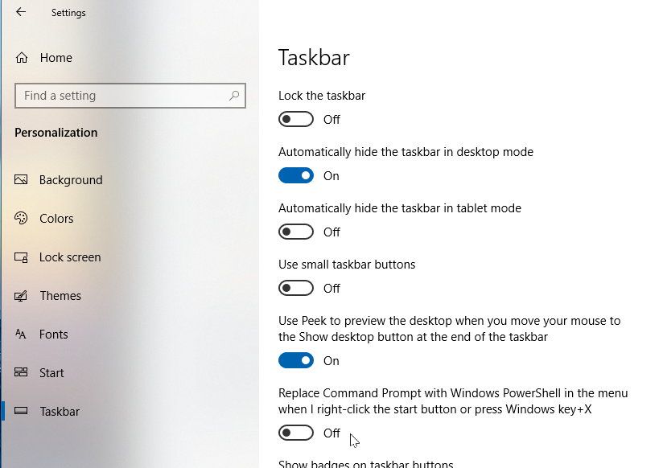

<!-- index.md 0.0.6                 UTF-8                          2022-06-19
     ----1----|----2----|----3----|----4----|----5----|----6----|----7----|--*

                      SELECTING COMMAND PROMPT OPERATION

     -->

# T060501d: [Selecting Command Prompt Operation](.)

| ***[nfoTools](../../../)*** | [tools](../../)[>t060501](../)[>t060501d](.) | [index.html](index.html) ***0.0.6 2022-06-19*** |
| :--                |       :-:          | --: |
|  | Work-in-Progress |  |

## Direct CMD Selection

On Windows 10, CMD can be operated by immediate search, the same as for other
application programs.

First, enter "CMD" in the task bar search entry.

Command Prompt will be presented as the best match.

Initiate a command-line environment and Command Prompt by pressing Enter
on the keyboard or by clicking on the highlighted best match with a mouse.

The "prompt" is the beginning of lines up to the ">", such as
"`C:\Users\orcmi>`" above.  The automatic prompt identifies where the
command-line operation is taking place.

There are command-line operations for navigating among the computer folders.
There are useful ways to initiate the Command Prompt via shortcuts directly
to desired places.

----

Windows 11 also offers immediate access to CMD via search on the task bar.

Some of the difference in presentation is from searching with "Command"
instead of "CMD" in the search field.  There are the same options for pinning
Command Prompt as on Windows 10.

----

## Other Ways to Launch Command Prompt

### The Windows 10 Start Context (Win+X)

Right-clicking on the Windows 10 task bar far-left Windows Symbol will pop-up
a list of Windows features options, including Command Prompt.

If there is an option for PowerShell instead of the Command Prompt option
shown, turn off the option to Replace Command
Prompt in Windows Settings | Personalization | Taskbar.

The same pop-up is available everywhere in Windows 10 by selecting Windows
key+X.

### The Windows 11 Start Context (Win+X)

Windows 11 replaces the Windows 10 options for Command Prompt and PowerShell
with context options for Windows Terminal.

Selecting Windows Terminal provides a command-line environment using Windows
Powershell by default.  This is also the case for Windows Terminal installed
on Windows 10.

Command Prompt remains available using the "Open a new tab" pull-down of an
open Terminal.

The Command Prompt tab can be used the same as with a standalone setup.  The
Windows PowerShell tab can be closed if not needed.

Windows Terminal can be configured to start up with the Command Prompt tab
instead of PowerShell.  Better yet, there are arrangements to launch in
different locations and with other options.

----

Discussion about nfoTools is welcome at the
[Discussion section](https://github.com/orcmid/nfoTools/discussions).
Improvements and removal of defects in this particular documentation can be
reported and addressed in the
[Issues section](https://github.com/orcmid/nfoTools/issues).  There are also
relevant [projects](https://github.com/orcmid/nfoTools/projects) from time to
time.

<!-- ----1----|----2----|----3----|----4----|----5----|----6----|----7----|--*

     0.0.6 2022-06-19T01:41Z Provide correct top heading strip
     0.0.5 2021-09-20T23:50Z Touch-ups
     0.0.4 2021-09-17T20:16Z Update Discussion invitation
     0.0.3 2021-09-16T22:48Z Proof-reading touchups
     0.0.2 2021-09-16T22:24Z Full Draft on Windows 10/11
     0.0.1 2021-09-16T17:49Z Trial Top-banner introduction
     0.0.0 2021-09-16T02:01Z Create placeholder to morph into the
           necessary material

           *** end of docs/tools/T060501/T060501d/index.md ***
     -->
