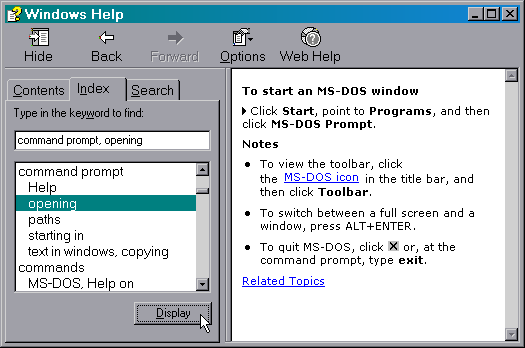
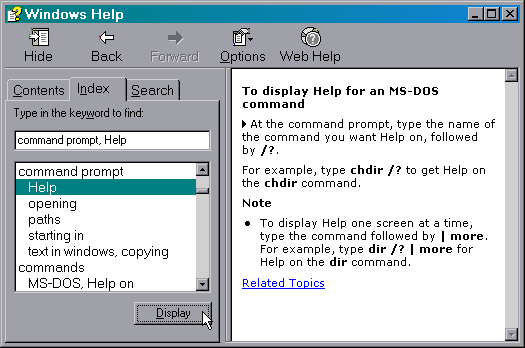
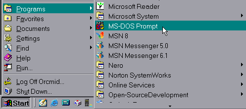
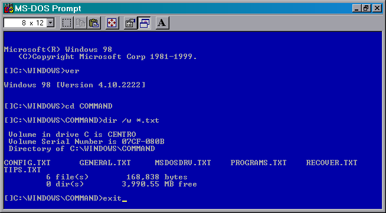

<!-- index.md 0.0.3                 UTF-8                          2022-06-29
     ----1----|----2----|----3----|----4----|----5----|----6----|----7----|--*

                    WINDOWS BUILT-IN HELP (HISTORICAL)

     -->

# T060501e: [Windows Built-In Help (Historical)](.)

| ***[nfoTools](../../../)*** | [tools](../../)[>t060501](../)[>t060501e](.) | [index.html](index.html) ***0.0.3 2022-06-29*** |
| :--                |       ---          | --: |
|  | Work-in-Progress |  |

1. Built-In Help

2. Older Built-In Help
The following examples were produced on Microsoft Windows 98SE.  Similar provisions can be found on all versions of windows from Windows 95 to Windows ME.  We have excluded information on the older, non-Win32 versions of Windows (e.g., Windows 3.11 and earlier).

2.1 Windows Help for Console Operation

The MS-DOS-based versions of Win32, from Windows 95 through Windows ME, provide MS-DOS console sessions.  There is limited guidance in Windows Help.

Windows Help for Windows is found on the Start Menu.  Use keyword "command prompt" to find the available information in the Windows Help Index pane (fig. 2-1).

The built-in help is more limited than for recent Windows versions starting with Windows 2000.  Current Windows PCs have greater capacity and performance.  This allows for expanded tutorial and help material, as well as connection to help information on the Internet.

In the older Win32 versions of Microsoft Windows there is an an MS-DOS shell with operation very similar that of MS-DOS.  There is integration with the MS-DOS console sessions under Windows, including communication via the Windows clipboard and initiation of Windows applications, MS-DOS applications, and additional console sessions.  It is also possible to force a "pure" native-mode MS-DOS session that has exclusive use of the machine until the session is exited and Windows restores to operation.  Details of these capabilities are provided in text files as part of the materials available in the command-utilities directory

2.2 Help At the Command Prompt
Although there is limited Windows Help information, further assistance can be found within the MS-DOS console session (fig. 2-2):

Windows Help tip on individual MSDOS-console commands (Windows 98 SE)

In older Windows versions, An MS-DOS Console Session is initiated with the MS-DOS Prompt on the Start | Programs menu list as specified in Windows Help.

The console window may open full screen or inside of an MS-DOS Prompt window.  Use Alt+Enter on the keyboard to toggle between the two cases.

There can be multiple console sessions at the same time.  Console sessions can start other console sessions in the same or different windows.

There is no overall help provided as part of a normal installation of Windows 98 SE.  However, there are additional text files in the same location as the MS-DOS utilities that are installed.  These files provide additional information (fig. 2-3).  There is also a Help application and additional command-line utilities and documentation on the Windows 98 SE CD-ROM in the \tools\oldmsdos directory.  The files listed below provide technical information.  They may be in the C:\WINDOWS directory if not found in the C:\WINDOWS\COMMAND directory.

{references}

{contributors}

{attribution}

----

Discussion about nfoTools is welcome at the
[Discussion section](https://github.com/orcmid/nfoTools/discussions).
Improvements and removal of defects in this particular documentation can be
reported and addressed in the
[Issues section](https://github.com/orcmid/nfoTools/issues).  There are also
relevant [projects](https://github.com/orcmid/nfoTools/projects) from time to
time.

<!-- ----1----|----2----|----3----|----4----|----5----|----6----|----7----|--*

     0.0.3 2022-06-29T01:47Z Use corrected top header strip
     0.0.2 2021-09-20T17:39Z Rough Draft Transposed to nfoTools
     0.0.1 2007-08-12T01:47Z Repaving Review (nfoWare)
     0.0.0 2006-05-29T00:25Z Create Initial Placeholder (nfoWare)

          *** end of docs/tools/T060501/T060501e/index.md ***
     -->
