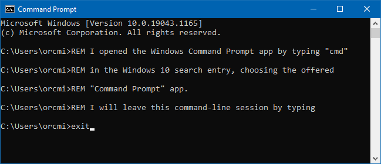

<!-- index.md 0.0.11                UTF-8                          2021-09-16
     ----1----|----2----|----3----|----4----|----5----|----6----|----7----|--*

                    WINDOWS CMD COMMAND-LINE ENVIRONMENT
     -->

# ToolCraft: Windows CMD Command-Line Environment

>> ***Ed.Note: This material is dated. It fails to achieve the objective
and extensive revision is called for.***

This article provides basic orientation for beginning developers and others
who want to understand Microsoft Windows CMD Command Prompt operation and the
command-line environment that it supports.  It is an element of toolcraft in
software development and information technology activities on Windows PCs.

The basics:

* knowing what the CMD command-line environment is and recognizing one on your
computer
* initiating and terminating command-line operations
* performing common command-line operations
* operating applications in the provided console
* using batch scripts (`.bat` files) in repetitive tasks
* experimenting and exploring additional capabilities available with Command
Prompt
* finding resources and explanations for advanced use of Command Prompt

There is no intention to duplicate the extensive Microsoft and MSDN materials
that are freely available on this topic. Sources of additional materials are
identified.

----

Discussion about these tools and the emphasized toolcraft are invited in the
nfoTools [Discussion section](https://github.com/orcmid/nfoTools/discussions).
Improvements and removal of defects in this particular documentation can be
reported and addressed in the
[Issues section](https://github.com/orcmid/nfoTools/issues).

## Available Materials

| **ID** | **Started** | **Status** | **Topic** |
|   :-:   |   :-:   |  :-:   |  ---  |
| [T060501d](T060501d/)     | 2021-09-15 | 0.0.2 2021-09-16 | Selecting Command Prompt Operation |
| [T060501c](T060501c.html) | 2006-05-20 | 0.0.31 2021-09-15 | Resources |
|                           |            |                   |           |
| [T060501a](T060501a.html) | 2006-05-21 | 0.0.3 2021-09-15 | Diary \& Job Jar |

<!-- ----1----|----2----|----3----|----4----|----5----|----6----|----7----|--*

     0.0.11 2021-09-16T22:29Z Reflect T060501d 0.0.2
     0.0.10 2021-09-16T02:08Z Add T060501d 0.0.0
     0.0.9 2021-09-15T20:27Z Add T060501a 0.0.3
     0.0.8 2021-09-15T17:02Z Smoothed to use chosen command-line environment
           terminology.
     0.0.7 2021-09-07T01:59Z Rework, simplifying and smoothing the text
     0.0.6 2021-09-06T21:39Z Add Command Prompt window capture
     0.0.5 2021-09-06T19:49Z Keep up with T060501c
     0.0.4 2021-09-06T19:10Z Touch-up
     0.0.3 2021-09-06T18:00Z Add Resources available material
     0.0.2 2021-09-06T00:06Z Initial Transposition of nfoWare.com t060501
           Windows Console Session folio cover to nfoTools T060502
     0.0.1 2007-08-12T00:26Z Repaving Review on nfoWare toolNote t060502
     0.0.0 2006-05-20T20:54Z Create bootstrap placeholder to morph into the
           necessary material

               *** end of docs/tools/T060501/index.md ***
     -->
