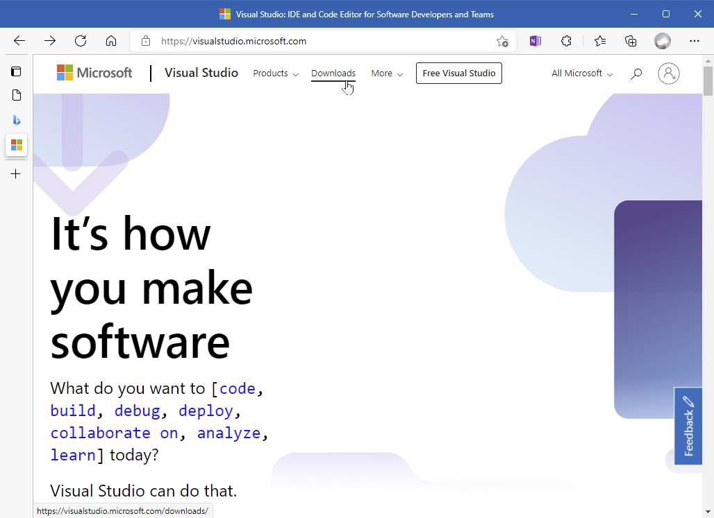
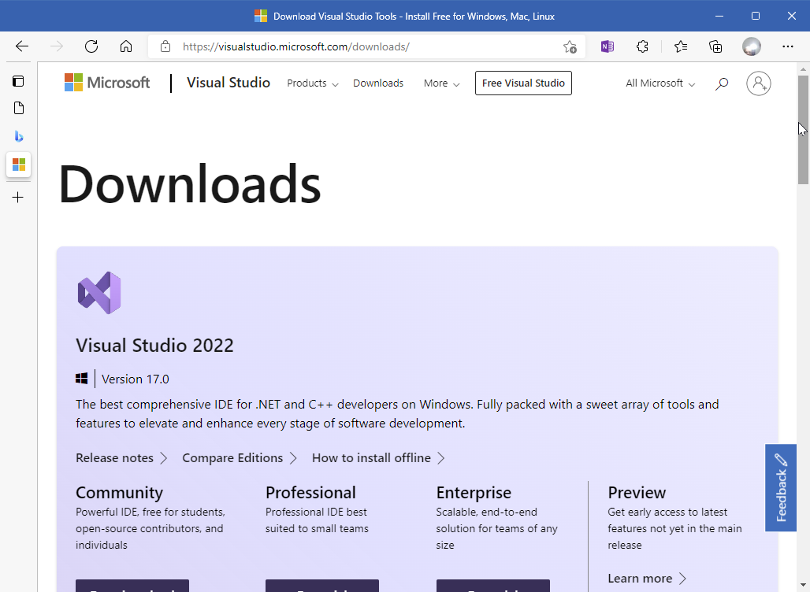
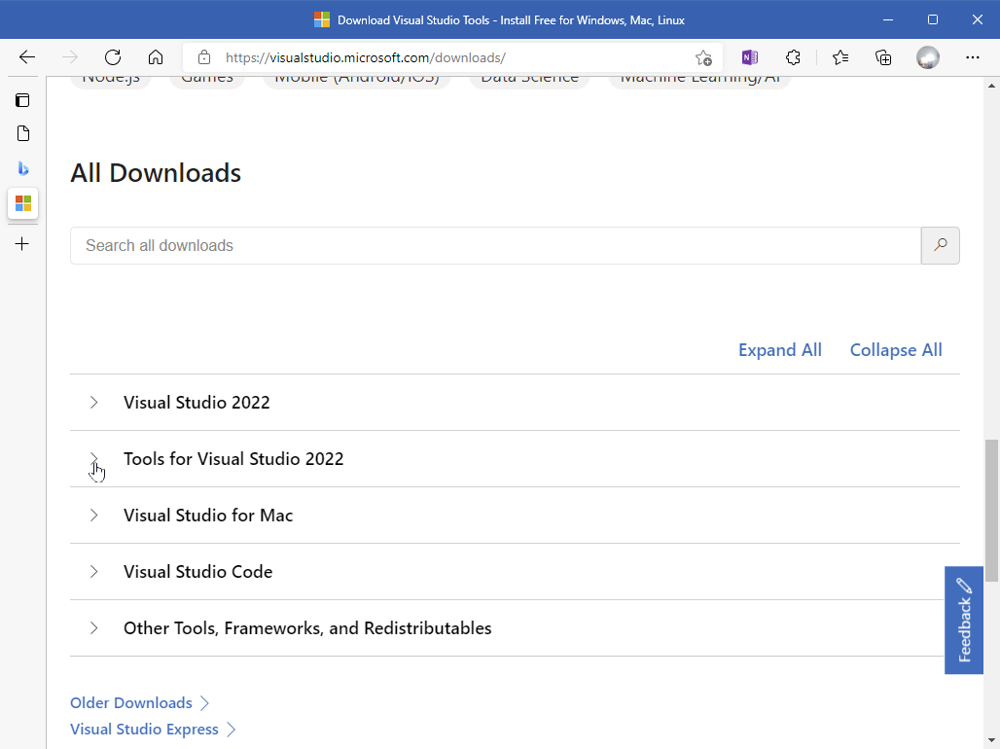
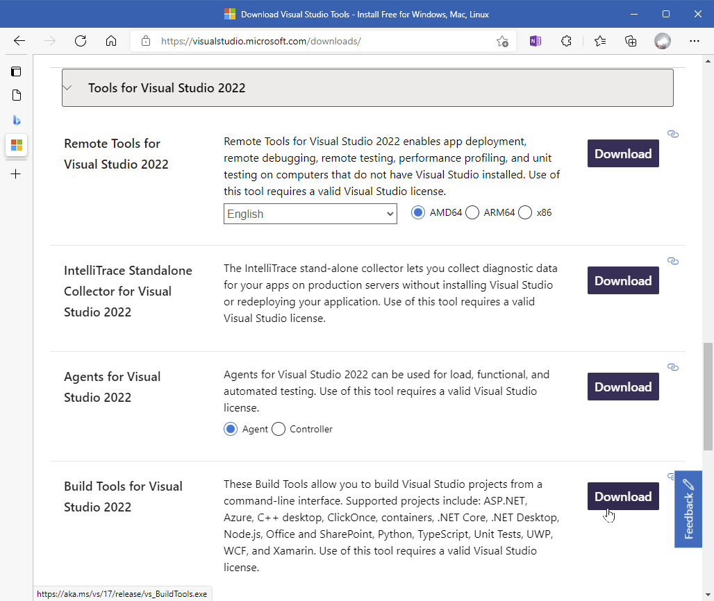
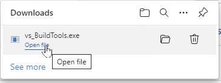
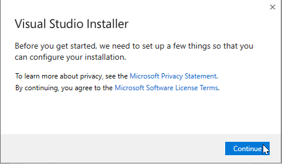
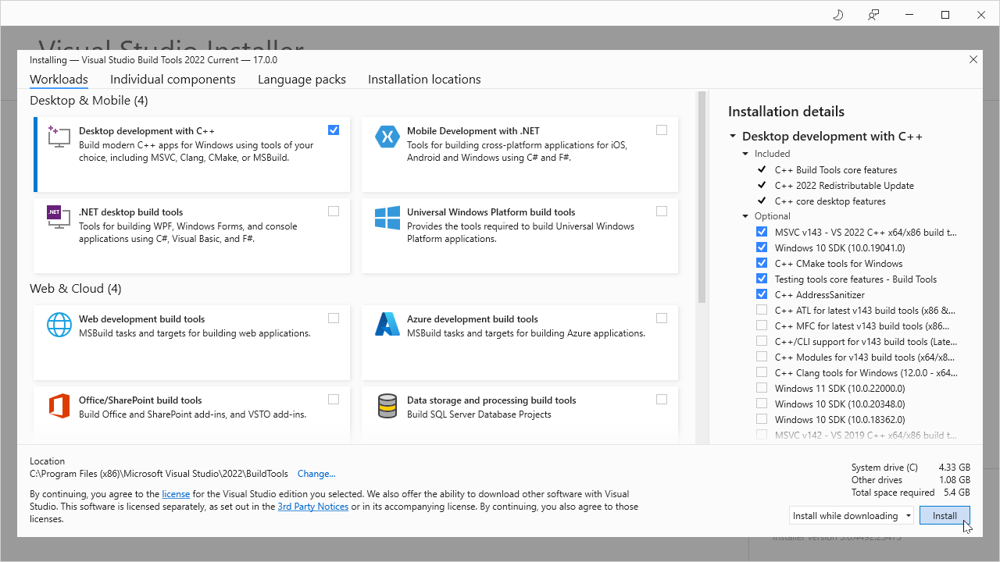
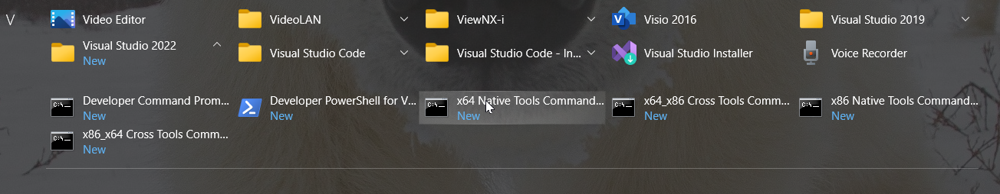

<!-- T21002c1.md 0.0.0              UTF-8                          2021-11-**
     ----1----|----2----|----3----|----4----|----5----|----6----|----7----|--*

                   DETAILED VS 2022 BUILD TOOLS DOWNLOADING
     -->

# ToolCraft: VS 2022 Build Tools Downloading Details

| ***[T211002c](index.html)*** | [tools](../../)[>T211002](../)[>T211002c](.)[>T21002c1](T21002c1.html) | ***0.0.0 2021-11-12*** |
| :--                |       ---          | --: |
|  | Work-in-Progress |  |

## Finding Visual Studio 2022 Build Tools

As of 2021-11-08, the latest release of Visual Studio is VS 2022.  Employ this
until a later version is available and desired.

Microsoft Visual Studio web pages vary depending on new releases, promotions,
general alterations of[microsoft.com](https://microsoft.com) web publication.

Visual Studio materials are found at
[visualstudio.microsoft.com](https://visualstudio.microsoft.com), displaying
on 2021-11-12 as

Select Downloads on the page heading.  The featured "Free Visual Studio"
includes much more than required for getting started with Build Tools.  They
can be explored later.

In this case, VS Build Tools are not featured at the beginning.  Scroll down
to the "All Downloads" section.

Click the ">" next to "Tools for Visual Studio 2022" to see what is covered.

Fourth down in the list is "Build Tools for Visual Studio 2022."  Select that
Download for delivery of the software.

Terms of use are covered on installation of the download.  The installed build
tools simply have to be used with a provided Command Prompt.  If there is any
concern about that, the free Visual Studio 2022 Community Edition is an
alternative that has build tools that can be used the same way for starters.

## Downloading the Visual Studio Installer

> *Found enough?* Back to
[Run the Install](index.html##running-the-downloaded-installer)

## Running the Downloaded Installer

When the download completes, run (open) the program.

Visual Studio Installer installs and remains under All Programs for future
use.  Use it later to change the configuration and to check for updates.
Confirm the license terms here.

At the Installer panel of workload choices, choose "Desktop Development with
C++" (shown below).  The checked Installation details are offered by default.
Those are enough for starters.

When the installation is completed, the Windows All Programs display under "V"
will show the Visual Studio Installer.  Expanding the Visual Studio 2022
folder reveals the available Command Prompts for operating in Native Tools
command-line environments.

----

Discussion about nfoTools is welcome at the
[Discussion section](https://github.com/orcmid/nfoTools/discussions).
Improvements and removal of defects in this particular documentation can be
reported and addressed in the
[Issues section](https://github.com/orcmid/nfoTools/issues).  There are also
relevant [projects](https://github.com/orcmid/nfoTools/projects) from time to
time.

<!-- ----1----|----2----|----3----|----4----|----5----|----6----|----7----|--*

     0.0.2 2021-11-12T04:27Z Cycling through progressive edit confirmations
     0.0.1 2021-10-30T15:54Z Repair dates
     0.0.0 2021-10-27T21:52Z Clone from tools/T211001c/index.md for
           boilerplate

            *** end of docs/tools/T211002/T211002c/index.md ***
     -->
