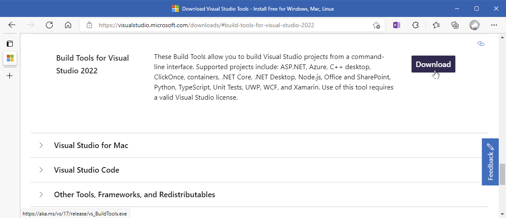
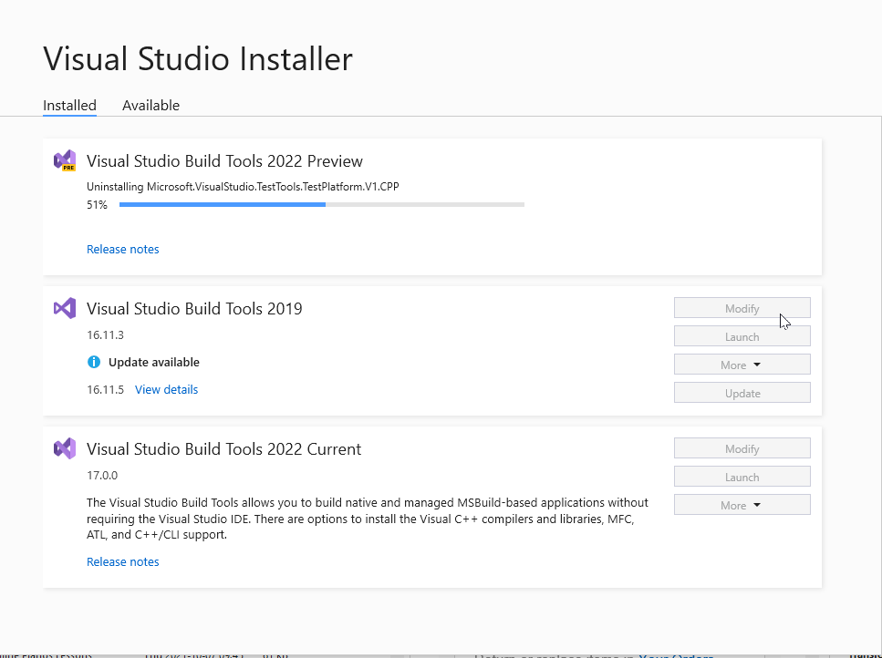
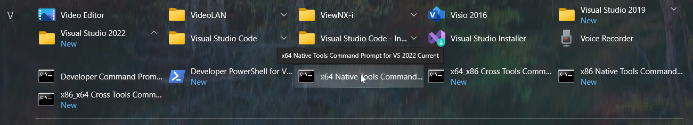
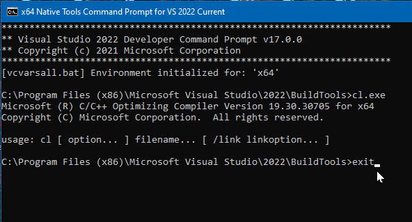

<!-- index.md 0.0.3                 UTF-8                          2021-11-12
     ----1----|----2----|----3----|----4----|----5----|----6----|----7----|--*

                      VS BUILD TOOLS INSTALLATION
     -->

# ToolCraft: VS Build Tools Installation

| ***[T211002c](index.html)*** | [tools](../../)[>T211002](../)[>T211002c](.) | ***0.0.1 2021-10-30*** |
| :--                |       ---          | --: |
|  | Work-in-Progress |  |

## Downloading Build Tools for Visual Studio

The current (VS 2022) Build Tools download is available at
[visualstudio.microsoft.com/downloads/#build-tools-for-visual-studio-2022](https://visualstudio.microsoft.com/downloads/#build-tools-for-visual-studio-2022)

> *Not finding it?*  [Try step-by-step.](T211002c1)

Terms of use are covered on installation of the download.  The installed build
tools simply have to be used with a provided Command Prompt.  If there is any
concern about that, the free Visual Studio 2022 Community Edition is an
alternative that has build tools used the same way for starters.

## Running the Downloaded Installer

When the download completes, run (open) the program.

This initiates installation of a Visual Studio Installer that will take over
downloading of the build tools.

> *How was this point reached?* [More details](T211002c1)

The Visual Studio Installer is announced.  This is where the Microsoft
Software License Terms can be reviewed.

> *When does this happen?* [More details](T211002c1)

On continuation, the VS Installer
will indicate options for Build Tool features to be installed.

At the Installer panel of workload choices, choose "Desktop Development with
C++" (shown above).  The checked Installation details are offered by default.
Those are enough for starters.

> *What are the final steps?* [Details](T211002c1)

When the Installer completes setup of VS 2022 Build Tools, the available
installs are listed, and "Visual Studio Build Tools 2022 Current" is
included.  The illustrated case also demonstrates a setup with VS2019 Build
Tools also present and a VS 2022 Preview being removed.

## Confirming Installation Success

When the installation is completed, the Windows All Programs display under "V"
will show the Visual Studio Installer.  Expanding the Visual Studio 2022
folder reveals the available Command Prompts for operating in Native Tools
command-line environments.

Click on "x64 Native Tools Command..." to initiate a Build Tools command-line
environment.

![x64 Environment]{VSBuildTools-2021-11-12-1453-x64NativeEnvironment.png}

At the prompt `>` type "cl.exe" (shown), and depress "Enter."

The C/C++ Optimizing Compiler is identified and its command-line usage
summarized.  Enter "exit" at the new prompt.  Press "ENTER" to close the
session.

Installation of the Build Tools is complete.  Now to put the tools to work.

----

Discussion about nfoTools is welcome at the
[Discussion section](https://github.com/orcmid/nfoTools/discussions).
Improvements and removal of defects in this particular documentation can be
reported and addressed in the
[Issues section](https://github.com/orcmid/nfoTools/issues).  There are also
relevant [projects](https://github.com/orcmid/nfoTools/projects) from time to
time.

<!-- ----1----|----2----|----3----|----4----|----5----|----6----|----7----|--*

     0.0.3 2021-11-12T23:13Z Completed first draft
     0.0.2 2021-11-12T04:27Z Cycling through progressive edit confirmations
     0.0.1 2021-10-30T15:54Z Repair dates
     0.0.0 2021-10-27T21:52Z Clone from tools/T211001c/index.md for
           boilerplate

            *** end of docs/tools/T211002/T211002c/index.md ***
     -->
