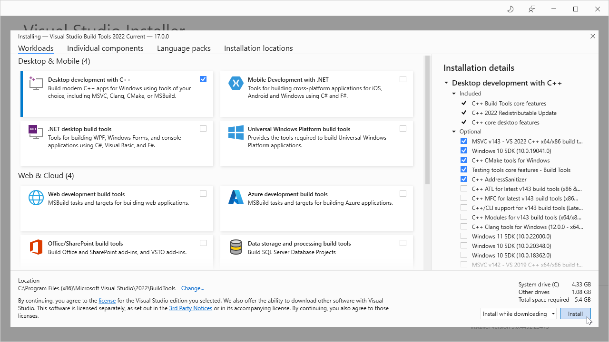

<!-- index.md 0.0.2                 UTF-8                          2021-11-12
     ----1----|----2----|----3----|----4----|----5----|----6----|----7----|--*

                      VS BUILD TOOLS INSTALLATION
     -->

# ToolCraft: VS Build Tools Installation

| ***[T211002c](index.html)*** | [tools](../../)[>T211002](../)[>T211002c](.) | ***0.0.1 2021-10-30*** |
| :--                |       ---          | --: |
|  | Work-in-Progress |  |

## Downloading Build Tools for Visual Studio

The current (VS 2022) Build Tools download is found at
[visualstudio.microsoft.com/downloads/#build-tools-for-visual-studio-2022](https://visualstudio.microsoft.com/downloads/#build-tools-for-visual-studio-2022)

  . *Not finding it?*  [Try step-by-step.](T211002c1)

Terms of use are covered on installation of the download.  If there is any
concern, the free Visual Studio 2022 Community Edition is an alternative.
The installed build tools simply have to be used with a provided Command
Prompt.

## Running the Downloaded Installer

When the download completes, run (open) the program.

The Visual Studio Installer remains under All Programs for future use.
Use it later to change the configuration and to check for updates.  Confirm
the license terms here.

When the Installer offers a panel of workload choices, choose "Desktop
Development with C++" (shown below).  The checked Installation details are
offered by default.  Those are enough for starters.

When the installation is completed, the All Programs display under "V" will
show the Visual Studio Installer.  Expanding the Visual Studio 2022 folder
will reveal the available Command Prompts for operating in Native Tools
command-line environments.

----

Discussion about nfoTools is welcome at the
[Discussion section](https://github.com/orcmid/nfoTools/discussions).
Improvements and removal of defects in this particular documentation can be
reported and addressed in the
[Issues section](https://github.com/orcmid/nfoTools/issues).  There are also
relevant [projects](https://github.com/orcmid/nfoTools/projects) from time to
time.

<!-- ----1----|----2----|----3----|----4----|----5----|----6----|----7----|--*

     0.0.2 2021-11-12T04:27Z Cycling through progressive edit confirmations
     0.0.1 2021-10-30T15:54Z Repair dates
     0.0.0 2021-10-27T21:52Z Clone from tools/T211001c/index.md for
           boilerplate

            *** end of docs/tools/T211002/T211002c/index.md ***
     -->
