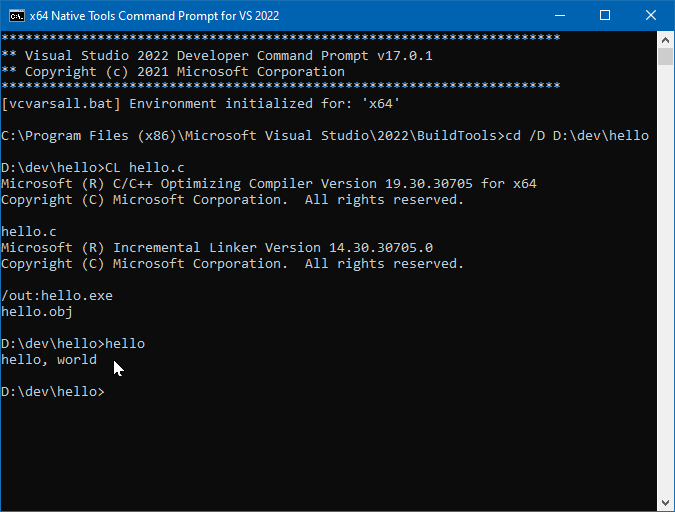

<!-- index.md 0.0.4                 UTF-8                          2021-11-20
     ----1----|----2----|----3----|----4----|----5----|----6----|----7----|--*

                      VISUAL STUDIO BUILD TOOLS
     -->

# ToolCraft: Visual Studio Build Tools

| ***[T211002](.)*** | [tools](../)[>T211002](.) | ***0.0.4 2021-11-20*** |
| :--                |       :-:          | --: |
|  | Visual Studio Build Tools |  |

Installing VS Build Tools is sufficient for beginner/novice use
in learning how to do C/C++ program development within a command-line
environment. VS Build Tools are freely available for download and
installation from <https://visualstudio.microsoft.com>.  Details are at
[T21002c](T211002c) here.

## Visual Studio Installer

The setup of VS Build Tools is accompanied by an included Visual Studio
Installer.  The VS Installer can be used for updates and addition of
tools for additional project types (workloads).  Tools sufficient for C/C++
projects are obtained by checking a single box.

> *HOW TO:* [Setting this up](T211002c)

## The Famous "Your First Program"

The traditional
([1978](../T060101/T060101b.html#kernighan-brian-w-ritchie-dennis-m-1988-the-c-programming-language))
C Language first-program demonstration is essentially
unchanged using the command-line environment of modern (2021) Visual Studio
Build Tools.

> *HOW TO:* Getting to "Hello World"

## Next Steps

Visual Studio Code is recommended for use with the VS Build Tools along
with a [Command Prompt](..\T060501) command-line environment.  Features of
 VS Code that provide more-integrated operation will provide supplementary
 streamlining only after the command-line foundation is fully established.
 Details are in [T211001](..\T211001) here.

## More Background

The VS Build tools are also incorporated in Visual Studio Community
Editions and professional levels of Visual Studio.  The integrated
development environment (IDE) of those editions relies on the same build
tools "under the covers" for C/C++ projects.  The direct use made in
nfoTools projects serves as a foundation for what is happening underneath
projects using such advanced tools.  This is helpful in learning to
troubleshoot difficulties in programming projects.

Using VS Build Tools in command-line environments is comparable to how
C/C++ programs are developed and compiled on other platforms, especially
Linux and other Unix-inspired operating systems.  The similarities are
strong enough so that books and examples of C/C++ that feature command-
line build tools for other platforms can be applied after adjusting for
differences in terminology.  The particular model originated in the 1950s,
predating Unix and C Language.

## Available Materials

| **ID** | **Started** | **Status** | **Topic** |
|   --:   |   :-:   |  :-:   |  :--  |
| [T211002c](T211002c/) | 2021-10-27 | 0.0.1 placeholder | VS Build Tools Installation |

## Related Material

| **ID** | **Topic** |
|  --:   |  :--  |
| [T060101](..\T060101) | C/C++ Programming |
| [T060501](..\T060501) | Windows CMD Command-Line Environment |
| [T211001](..\T211001) | Visual Studio Code |

----

Discussion about nfoTools is welcome at the
[Discussion section](https://github.com/orcmid/nfoTools/discussions).
Improvements and removal of defects in this particular documentation can be
reported and addressed in the
[Issues section](https://github.com/orcmid/nfoTools/issues).  There are also
relevant [projects](https://github.com/orcmid/nfoTools/projects) from time to
time.

<!-- ----1----|----2----|----3----|----4----|----5----|----6----|----7----|--*

     0.0.4 2021-11-20T01:03Z Close to complete
     0.0.3 2021-11-19T23:44Z Repair and touch-up
     0.0.2 2021-11-19T18:08Z Full Draft text
     0.0.1 2021-10-30T15:56Z Touch up dates
     0.0.0 2021-10-27T20:18Z Clone from T211001/index.md for boilerplate

               *** end of docs/tools/T211002/index.md ***
     -->
